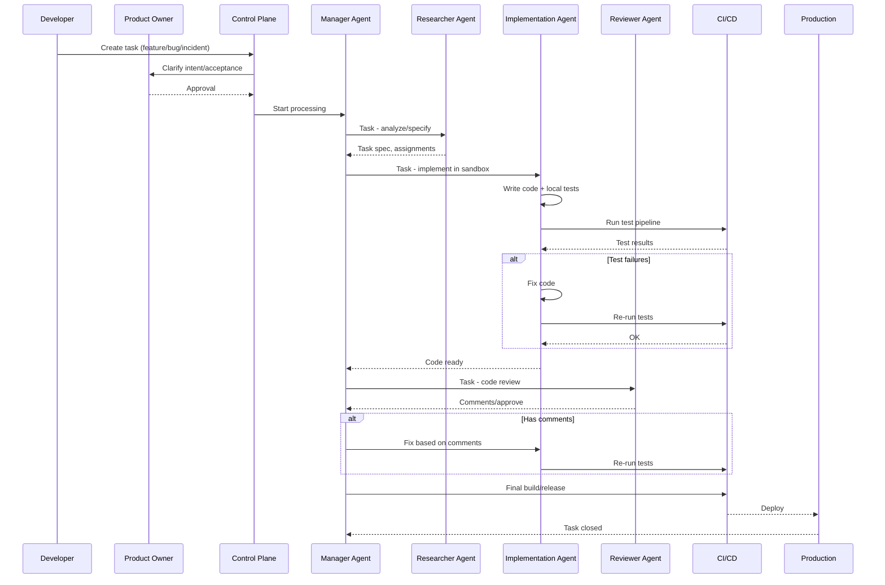

# OpenCode Initializer — AIPDLC Architecture Integration

> **Source:** Industry research (Agyn, Microsoft APM, MCP, Dify, VibeVM, BoxLite, OpenAI Codex, Team Topologies, Polomodov, Fowler, Martin)  
> **Date:** 2026-09-14  
> **Status:** INTEGRATION PLAN

---

## Executive Summary

Интеграция **AIPDLC (AI-Powered Development Lifecycle)** архитектуры в OpenCode Initializer создаёт **enterprise-grade платформу** для автономной AI-разработки с контролем, изоляцией и observability.

### Key Architectural Insights

| Concept | Source | Integration Point |
|---------|--------|-------------------|
| **Control Plane** | Agyn, Microsoft APM | Orchestrator module |
| **Work Graph** | Tessl, Dify | Task/dependency management |
| **Agent Isolation** | OpenAI Codex, BoxLite | Sandbox environments |
| **MCP Protocol** | Model Context Protocol | Tool/data integration |
| **Team Topologies** | Team Topologies | Role-based workflows |
| **Test Gauntlet** | Robert C. Martin | Automated verification |

---

## Architecture: Control Plane

### Core Components

```
┌─────────────────────────────────────────────────────────────┐
│                    CONTROL PLANE                             │
├─────────────────────────────────────────────────────────────┤
│  ┌─────────────┐  ┌─────────────┐  ┌─────────────┐         │
│  │ Orchestrator │  │ Work Graph  │  │   WAL/Journal│         │
│  │  (Manager)   │  │  (Context)  │  │   (Audit)    │         │
│  └──────┬──────┘  └──────┬──────┘  └──────┬──────┘         │
│         │                │                │                  │
│         ▼                ▼                ▼                  │
│  ┌─────────────────────────────────────────────────────┐    │
│  │              AGENT MESH                              │    │
│  ├─────────────┬─────────────┬─────────────┬───────────┤    │
│  │ Researcher  │ Implementer │  Reviewer   │  Manager  │    │
│  │   Agent     │   Agent     │   Agent     │   Agent   │    │
│  └──────┬──────┴──────┬──────┴──────┬──────┴──────┬────┘    │
│         │             │             │             │          │
│         ▼             ▼             ▼             ▼          │
│  ┌─────────────────────────────────────────────────────┐    │
│  │              SANDBOX LAYER                           │    │
│  ├─────────────┬─────────────┬─────────────┬───────────┤    │
│  │  Container  │  MicroVM    │  Firecracker│  BoxLite  │    │
│  │  (Docker)   │  (Kata)     │  (AWS)      │  (Rust)   │    │
│  └─────────────┴─────────────┴─────────────┴───────────┘    │
└─────────────────────────────────────────────────────────────┘
```

### Module Mapping

| AIPDLC Component | OpenCode Module | Status |
|------------------|-----------------|--------|
| **Orchestrator** | `setup.sh` (existing) | ✅ Complete |
| **Work Graph** | `src/lib/66-agent-orchestrator.sh` | 🔄 Phase 2 |
| **Agent Mesh** | `src/lib/68-agent-mesh.sh` | 🔄 Phase 2 |
| **Sandbox** | `src/lib/86-sandbox.sh` | 🆕 Phase 3 |
| **MCP Integration** | `src/lib/12-mcp.sh` (existing) | ✅ Complete |
| **LSP Integration** | `src/lib/13-lsp.sh` (existing) | ✅ Complete |
| **CI/CD** | `src/lib/87-cicd-integration.sh` | 🆕 Phase 3 |
| **Observability** | `src/lib/77-observability.sh` | 🔄 Phase 3 |

---

## Roles & Autonomy Levels

### Human Roles

| Role | Responsibilities | Autonomy Level |
|------|------------------|----------------|
| **Product Owner** | Define intent, approve acceptance criteria | 1 (Human decision) |
| **Architect/Tech Lead** | Architecture decisions, policy enforcement | 1 (Human) |
| **Developer** | Execute tasks, write code, tests | 2 (AI proposes, human reviews) |
| **QA Engineer** | Test scenarios, automation | 2 |
| **Security Officer** | Security rules, audit | 1 (Human) |
| **Platform Team** | Infrastructure, observability | 2 |

### AI Agent Roles

| Agent | Responsibilities | Autonomy Level |
|-------|------------------|----------------|
| **Manager Agent** | Coordinate workflow, delegate tasks | 3 (Autonomous) |
| **Researcher Agent** | Analyze codebase, generate specs | 3 |
| **Implementation Agent** | Write code, run tests in sandbox | 3 |
| **Reviewer Agent** | Code review, approve/reject PRs | 3 |

### Implementation

```bash
# Define roles in OpenCode
opencode role create --name product-owner --autonomy 1 --permissions [approve,reject]
opencode role create --name ai-manager --autonomy 3 --permissions [delegate,coordinate]
opencode role create --name ai-implementer --autonomy 3 --permissions [code,test]

# Assign roles
opencode role assign --user john --role product-owner
opencode role assign --agent manager-001 --role ai-manager
```

---

## Workflow: Intent → Context → Plan → Tasks → Implementation → Verification

### Mermaid Diagram



### Implementation

```bash
# Start workflow
opencode workflow start --task "fix-auth-bug" --intent "Fix authentication timeout"

# Monitor workflow
opencode workflow status --task-id abc123

# Approve at gates
opencode workflow approve --task-id abc123 --gate security
```

---

## Sandbox & Isolation

### Isolation Technologies

| Technology | Use Case | OpenCode Integration |
|------------|----------|---------------------|
| **Docker + seccomp** | Standard containers | `src/lib/86-sandbox.sh` |
| **Firecracker** | MicroVM (AWS) | `src/lib/86-sandbox.sh` |
| **Kata Containers** | Kubernetes microVM | `src/lib/86-sandbox.sh` |
| **BoxLite** | Rust library, OCI emulation | `src/lib/86-sandbox.sh` |
| **gVisor** | Google sandbox | `src/lib/86-sandbox.sh` |

### Security Policies

```yaml
# sandbox-policy.yaml
apiVersion: sandbox.opencode.ai/v1
kind: AgentSandbox
metadata:
  name: implementation-agent
spec:
  isolation: microvm  # or container
  network:
    outbound: false  # block all outbound
    allowedDomains:
      - github.com
      - registry.npmjs.org
  filesystem:
    readonly: ["/etc", "/usr"]
    writable: ["/tmp", "/workspace"]
  resources:
    cpu: "2"
    memory: "4Gi"
    timeout: "30m"
  secrets:
    vault: true
    shortLived: true
```

### Implementation

```bash
# Create sandbox
opencode sandbox create --name impl-agent --policy sandbox-policy.yaml

# Run agent in sandbox
opencode agent run --sandbox impl-agent --agent implementation

# Monitor sandbox
opencode sandbox status --name impl-agent
```

---

## MCP Integration

### MCP Server Registry

| Server | Purpose | Package |
|--------|---------|---------|
| **GitHub MCP** | GitHub context | `@modelcontextprotocol/server-github` |
| **Filesystem MCP** | File operations | `@modelcontextprotocol/server-filesystem` |
| **Postgres MCP** | Database access | `@modelcontextprotocol/server-postgres` |
| **Memory MCP** | Context persistence | `@modelcontextprotocol/server-memory` |
| **Custom MCP** | Internal APIs | Custom implementation |

### APM Integration

```yaml
# apm.yml
name: my-project
version: 1.0.0
mcp:
  servers:
    - name: github
      package: "@modelcontextprotocol/server-github"
      transport: stdio
    - name: internal-api
      url: https://mcp.internal.company.com
      transport: http
skills:
  - name: code-review
    version: 1.2.0
    source: tessl://code-review
  - name: security-audit
    version: 2.0.0
    source: opencode://security-audit
```

### Implementation

```bash
# Install APM
opencode apm install

# Sync MCP servers
opencode mcp sync

# List available MCP tools
opencode mcp list
```

---

## Observability & Metrics

### Event Schema

```json
{
  "timestamp": "2026-09-14T12:00:00Z",
  "agent_id": "implementation-agent-001",
  "action_type": "code_generation",
  "inputs_digest": "sha256:abc123",
  "llm_model": "deepseek-v4-pro",
  "tokens_in": 1500,
  "tokens_out": 800,
  "result_summary": "Generated auth.py with 3 functions",
  "exit_code": 0,
  "cost": 0.0023
}
```

### Key Metrics

| Category | Metric | Target |
|----------|--------|--------|
| **Performance** | Lead Time (issue→deploy) | < 2 hours |
| **Performance** | Throughput (tasks/week) | 50+ |
| **Performance** | Agent Success Rate | > 80% |
| **Quality** | Test Coverage | > 80% |
| **Quality** | Post-release Bugs | < 5% |
| **Quality** | Change Failure Rate | < 10% |
| **Economics** | Cost per Task | < $0.50 |
| **Economics** | Human Hours Saved | 50%+ |
| **Adoption** | Developer Adoption | > 70% |

### Implementation

```bash
# View metrics dashboard
opencode metrics dashboard

# Export metrics
opencode metrics export --format prometheus

# Set alerts
opencode alert create --metric agent-success-rate --threshold 80 --action slack
```

---

## New Modules to Implement

### Phase 3: Enterprise Features (v17.0)

| Module | Description | Priority |
|--------|-------------|----------|
| `86-sandbox.sh` | Agent isolation (Docker, MicroVM, BoxLite) | HIGH |
| `87-cicd-integration.sh` | CI/CD pipeline integration | HIGH |
| `88-workflow-engine.sh` | Workflow orchestration | HIGH |
| `89-security-policies.sh` | OPA/Rego policy enforcement | HIGH |
| `90-secrets-manager.sh` | Vault/secrets integration | MEDIUM |

### Phase 4: Advanced Features (v18.0)

| Module | Description | Priority |
|--------|-------------|----------|
| `91-agent-memory.sh` | Persistent agent memory | MEDIUM |
| `92-context-engineering.sh` | Dynamic context injection | MEDIUM |
| `93-learning-loop.sh` | Continuous learning from feedback | MEDIUM |
| `94-automation-engine.sh` | Task automation | LOW |
| `95-distribution-manager.sh` | Custom agent distributions | LOW |

---

## Implementation Roadmap

### Q4 2026: Foundation

**Week 1-2:** Sandbox module (`86-sandbox.sh`)
- Docker + seccomp integration
- Basic isolation policies
- Resource limits

**Week 3-4:** CI/CD integration (`87-cicd-integration.sh`)
- GitHub Actions integration
- GitLab CI integration
- Test pipeline automation

**Week 5-6:** Workflow engine (`88-workflow-engine.sh`)
- YAML workflow definitions
- Multi-agent orchestration
- Gate management

**Week 7-8:** Testing & Documentation
- Unit tests for all modules
- Integration tests
- Documentation

### Q1 2027: Enterprise Hardening

**Week 1-2:** Security policies (`89-security-policies.sh`)
- OPA/Rego integration
- Policy enforcement
- Audit logging

**Week 3-4:** Secrets management (`90-secrets-manager.sh`)
- Vault integration
- Short-lived credentials
- Secret rotation

**Week 5-6:** Observability enhancement
- OpenTelemetry integration
- Grafana dashboards
- Alert management

**Week 7-8:** Testing & Documentation

---

## Competitive Positioning

| Feature | OpenCode Initializer | Tessl | Goose | Claude Code |
|---------|---------------------|-------|-------|-------------|
| **Control Plane** | ✅ | ✅ | ❌ | ❌ |
| **Agent Isolation** | ✅ (Docker, MicroVM) | ❌ | ❌ | ❌ |
| **MCP Integration** | ✅ (24 servers) | ✅ | ✅ | ❌ |
| **RBAC** | ✅ | ✅ | ❌ | ❌ |
| **Workflow Engine** | ✅ | ❌ | ✅ | ❌ |
| **Observability** | ✅ | ✅ | ❌ | ❌ |
| **Open Source** | ✅ | ❌ | ✅ | ❌ |

---

## References

1. **Agyn** — Multi-role agent architectures
2. **Microsoft APM** — Agent Package Manager
3. **MCP Protocol** — Model Context Protocol
4. **Dify** — Agent workflow platform
5. **VibeVM** — Specification-driven development
6. **BoxLite** — Lightweight OCI emulation
7. **OpenAI Codex** — Sandbox and permissions
8. **Team Topologies** — Organizational patterns
9. **Polomodov** — AI in SDLC
10. **Fowler** — Engineering loops and agent harness
11. **Martin** — Automated test gauntlet

---

*Integration plan for OpenCode Initializer v15.0+*
