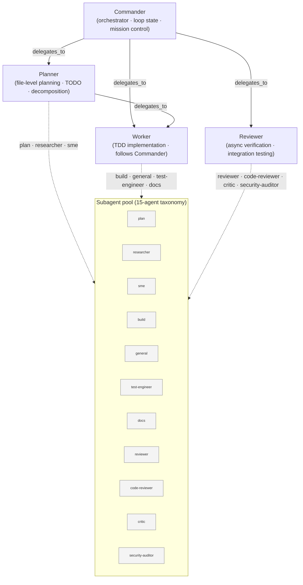
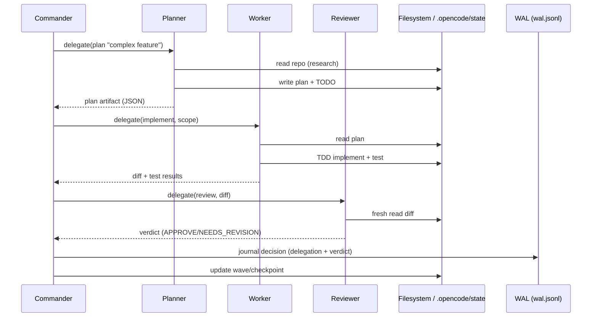
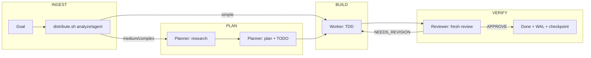

# Agent Role Definitions — 2026

**Status:** Canonical reference
**Scope:** Multi-agent orchestration architecture for `opencode_initializer`
**SSOT anchors:** `src/lib/54-task-distributor.sh` (agent registry + distribution rules), `src/data/routing.json` (model routing), `docs/architecture/agent-system.en.md` (15-agent taxonomy), `docs/architecture/adr/multi-agent-framework-v3.md` (operating model), `.opencode/skills/coprocessor/SKILL.md` (protocols).

---

## 1. Agent Hierarchy

The system is a **four-role orchestration hierarchy** — `Commander → Planner → Worker → Reviewer` — layered on top of the broader 15-agent subagent pool. The four roles are the orchestration spine; the 15 subagents are the specialization pool that each role may fan out to. This document defines the four-role hierarchy as the canonical interface and maps it onto the pool.



### 1.1 Commander

The top of the hierarchy. Owns the **loop state** (`loop` skill), **mission control**, and **parallel execution** fan-out.

| Attribute | Value |
|-----------|-------|
| `[CTX]` anchor | `orch` |
| Capabilities | `orchestration`, `delegation`, `verification`, `mission_control` |
| Delegates to | `Planner`, `Worker`, `Reviewer` |
| Best for | complex, multi-agent, end-to-end |
| Reasoning mode | System 2 (methodical) |
| Complexity tier | `complex` (max_minutes: 999, flow: `orchestrate`) |

**Responsibilities**

- Receive the top-level goal; own the *why* and the *done* criteria.
- Decompose complex scope into parallelizable subtasks (via `54-task-distributor.sh` `split` / `parallel`).
- Decide **parallel vs serial** dispatch and enforce wave ordering.
- Maintain `current_wave.md` and `session_checkpoint.json` continuity.
- Aggregate results from Planner/Worker/Reviewer and synthesize the final answer.
- Never implements directly — only delegates, verifies, and synthesizes.

### 1.2 Planner

File-level planner. Owns **research → planning → decomposition** before any code is written.

| Attribute | Value |
|-----------|-------|
| `[CTX]` anchor | `plan` |
| Capabilities | `research`, `analysis`, `planning`, `decomposition` |
| Delegates to | `Worker` |
| Best for | medium, research, design, planning |
| Reasoning mode | System 2 only |
| Complexity tier | `medium` (max_minutes: 30, flow: `plan_then_work`) |

**Responsibilities**

- Research the problem space against the Source Ladder (L1–L3) before writing specs.
- Produce **file-level plans** and create TODO files (`.opencode/todo.md`).
- Break a spec into discrete tasks with dependencies and acceptance criteria.
- Emit a structured plan (JSON contract) that a Worker can execute.
- Does **not** implement or verify — hands off to Worker.

### 1.3 Worker

The implementer. Follows the Commander/Planner plan and implements **test-first**.

| Attribute | Value |
|-----------|-------|
| `[CTX]` anchor | `build` |
| Capabilities | `implementation`, `testing`, `documentation`, `fixes` |
| Delegates to | *(nobody)* — leaf node |
| Best for | simple, coding, testing, debug, refactor, docs |
| Reasoning mode | System 1 → System 2 (escalates) |
| Complexity tier | `simple` (max_minutes: 5, flow: `direct`) |

**Responsibilities**

- Implement from a plan/spec using TDD (`tdd` skill): red → green → refactor.
- Execute single-file and (on escalation) multi-file edits.
- Write tests, docs, and fixes; run `tests/run_tests.sh`, `bash -n`, lint.
- **Hard rule:** the Worker delegates to nobody — it is always a leaf.

**System 1 → System 2 escalation** (from the Coprocessor protocol):

| Trigger | Response |
|---------|----------|
| Edit fails twice on the same target | Escalate to S2 |
| More than 3 files touched | Escalate to S2 |
| Uncertainty exceeds 30% | Escalate to S2 |
| User says "think about it" | Escalate to S2 |

### 1.4 Reviewer

Async verifier. Never implements — verifies others' work after the fact.

| Attribute | Value |
|-----------|-------|
| `[CTX]` anchor | `review` |
| Capabilities | `verification`, `validation`, `quality_checks` |
| Delegates to | *(nobody)* — leaf node |
| Best for | review, verification, qa |
| Reasoning mode | System 2 |
| Complexity tier | n/a (post-implementation gate) |

**Responsibilities**

- Adversarial bug/regression review with `file:line` references.
- Integration testing and end-to-end verification.
- Quality gates: coverage ≥80%, security audit, no drift.
- Independent context from the Worker (fresh read of the diff).
- Returns a verdict: `APPROVE` / `NEEDS_REVISION` / `REJECT`.

### 1.5 Hierarchy invariants

1. **Acyclic delegation.** `Commander` may delegate down; `Worker` and `Reviewer` never delegate up or sideways. The only cross-edges are `Commander→{Planner,Worker,Reviewer}` and `Planner→Worker`.
2. **Single owner per outcome.** Exactly one role owns the "done" verdict for any unit of work — the Reviewer for correctness, the Commander for scope.
3. **Leaf discipline.** Workers and Reviewers are leaves; no recursion beneath them.
4. **Loop state lives only in the Commander.** No lower role mutates wave/checkpoint state.

---

## 2. Agent Capabilities Matrix

### 2.1 Can / cannot

| Agent | Can | Cannot |
|-------|-----|--------|
| **Commander** | Decompose, dispatch, parallelize, aggregate, journal WAL, mutate loop/wave state, synthesize final answer | Write implementation code directly; verify correctness itself (delegates to Reviewer); touch leaf-task details |
| **Planner** | Research (L1–L3), write specs, create TODOs, produce file-level plans, estimate complexity, decompose | Implement; run tests as a gate; mark work "done"; delegate to Commander/Reviewer |
| **Worker** | Implement TDD, edit files, run tests/lint, write docs/fixes, escalate to S2 | Delegate (leaf); approve its own work as done (Reviewer does); re-plan architecture (Planner does); mutate wave state |
| **Reviewer** | Verify, validate, adversarial review, integration/e2e testing, emit verdict | Implement changes; re-plan; delegate; alter scope; touch wave/checkpoint state |

### 2.2 Tool access per agent

| Tool group | Commander | Planner | Worker | Reviewer |
|------------|:---------:|:-------:|:------:|:--------:|
| Read / glob / grep / codegraph (read-only) | ✅ | ✅ | ✅ | ✅ |
| File edit / write | ❌ | 📝 (plan/TODO files only) | ✅ | ❌ |
| Bash (test/lint/git) | ⚠️ (dispatch only) | ❌ | ✅ | ✅ (read-only commands) |
| Task delegation (`delegate_task`, `call_agent`, `dispatch_lanes`) | ✅ | ⚠️ (→ Worker only) | ❌ | ❌ |
| WAL append (`wal.jsonl`) | ✅ | ✅ | ✅ | ✅ |
| Web search / fetch (`web_search`, `context7`) | ⚠️ | ✅ | ❌ | ❌ |
| Secret-bearing tools | 🔒 (never) | 🔒 (never) | 🔒 (never) | 🔒 (never) |
| Wave/checkpoint state (`current_wave.md`, `session_checkpoint.json`) | ✅ | ❌ | ❌ | ❌ |

Legend: ✅ full · ⚠️ constrained · 📝 scoped-write · ❌ none · 🔒 denied by hard gate.

### 2.3 Permission model

Permissions are **role-scoped, deny-by-default**, and layered:

1. **Hard gates (all roles, non-negotiable)** — never emit secrets; never delete code you don't understand; never skip the WAL; never present speculation as fact (<80% confidence ⇒ `[speculative]`); never trust user paths blindly.
2. **Role scope** — a role may only use tools listed in §2.2; the Worker's write access is the only unrestricted write path.
3. **File scope containment** — Planner writes only under `docs/specs/`, `.opencode/todo.md`, plan artifacts; Worker writes within declared task scope; Commander writes loop/checkpoint/WAL state only.
4. **Skill gating** — distribution rules bind each task type to a skill (`implement`, `tdd`, `plan`, `code-review`, `diagnosing-bugs`, `improve-codebase-architecture`, `deep-research`). The skill is loaded at dispatch and further narrows allowed behavior.

### 2.4 Isolation level

| Agent | Isolation |
|-------|-----------|
| Commander | **Process-isolated orchestration** — no shared mutable context with workers beyond `.opencode/state/` and WAL; reads only summaries/results |
| Planner | **Read-scoped + plan-write** — reads the whole repo, writes only plan artifacts |
| Worker | **Write-scoped to declared files** — `declare_scope`/`files_touched` containment; must re-read before edit, verify after write |
| Reviewer | **Fresh-context isolation** — spawned with an independent context reading the diff from disk, never the Worker's in-memory state |



---

## 3. Agent Communication Protocol

Communication is **file-based IPC**. Files are the contract; there is no in-memory shared state between agents.

### 3.1 Channels

| Channel | Location | Write role | Read role | Purpose |
|---------|----------|-----------|-----------|---------|
| **Ephemeral coordination** | `.opencode/state/` | any role | any role | Short-lived handoffs, lane results, locks |
| **WAL journal** | `~/.cache/opencode/wal.jsonl` | all roles | all roles | Append-only decision/audit log |
| **Specs** | `docs/specs/`, `AGENTS.md`, `.opencode/skills/` | Planner (post-decision) | all roles | Persistent design truth |
| **Artifacts** | source, tests, configs | Worker | all roles | Ground truth (overrides specs) |
| **Loop state** | `current_wave.md`, `session_checkpoint.json` | Commander | Commander | Multi-session continuity |
| **Plan/TODO** | `.opencode/todo.md`, plan JSON | Planner | Worker, Reviewer | Executable work contract |

### 3.2 Read-before-write / verify-after-write

From the Coprocessor protocol, **every** agent:

1. **Reads the file before acting** — never trusts cached or memory-hinted state.
2. **Verifies after writing** — read-back confirms the write landed.
3. **Treats memory as a hint** — artifacts override stale specs; re-verify against live filesystem state.

### 3.3 WAL checkpointing

- **Format:** JSONL — `{"ts","domain","decision","rationale","impact","confidence","mode"}`
- **Checkpoint triggers:** tool error · model/provider switch · architectural decision · compaction event · every ~10 turns.
- **Ownership:** all four roles append; the Commander appends the delegation and the final verdict for every dispatched task.
- **Memory anchor:** every response starts with `[CTX: <domain>]` so a role can resume after context compaction without re-reading all files.

### 3.4 Task delegation

Delegation is **one-way down the hierarchy** and always carries a structured contract:

```
delegate_task(
  agent      = Worker|Planner|Reviewer,
  task       = "<atomic description>",
  scope      = [files allowed to modify],   # Worker only
  depends    = [task ids],                  # for parallel wave ordering
  background = true|false
)
```

- `54-task-distributor.sh` emits the pipeline for a task; each step carries `{step, agent, skill, depends}`.
- The **Skill** is attached at dispatch (e.g. `tdd`, `implement`, `code-review`) and constrains the receiving role's behavior.
- Results return as JSON (a verdict, a diff, test output) — **never raw prose between roles**.

### 3.5 Result aggregation

1. Workers/Reviewers write results to `.opencode/state/` (or return them via delegation).
2. The Commander collects, deduplicates, and reconciles conflicts.
3. Reviewer verdicts take precedence on correctness; Planner holds authority on design.
4. The final synthesis is journaled to the WAL and folded into `current_wave.md`.

---

## 4. Agent Routing

Routing is deterministic, keyword- and complexity-driven, and lives in one SSOT (`54-task-distributor.sh` `config.json` + `distribute.sh`).

### 4.1 Task complexity assessment

Complexity is scored by matching **complexity signals** against the task text:

| Tier | Signals (keywords) | Max minutes | Flow |
|------|--------------------|-------------|------|
| `simple` | typo, rename, single file, one file, trivial, quick, small, format | 5 | `direct` |
| `medium` | multiple files, multi-file, several, update, refactor, add tests, docs | 30 | `plan_then_work` |
| `complex` | system, architecture, end-to-end, migrate, rewrite, pipeline, orchestrate, all projects, framework | 999 | `orchestrate` |

Refinement rules (in `distribute.sh`): research/planning/orchestration intent upgrades `simple → medium`; orchestration intent upgrades `medium → complex`.

### 4.2 Agent selection criteria

Selection is the product of **task type** × **complexity**:

| Task type | Agent | Skill |
|-----------|-------|-------|
| coding | Worker | `implement` |
| testing | Worker | `tdd` |
| research | Planner | `deep-research` |
| planning | Planner | `plan` |
| review | Reviewer | `code-review` |
| debug | Worker | `diagnosing-bugs` |
| refactor | Worker | `improve-codebase-architecture` |
| docs | Worker | — |
| orchestration | Commander | — |

Overrides by complexity (highest precedence):

1. `complex` ⇒ **Commander** (regardless of type)
2. `research`/`planning` ⇒ **Planner**
3. `review` ⇒ **Reviewer**
4. otherwise ⇒ rule table ⇒ **Worker**

Keyword resolution is **priority-ordered** (`orchestration, review, debug, research, planning, testing, refactor, docs, coding`) so ambiguous phrases resolve deterministically — e.g. `"review code changes"` → `review`, not `coding`.

### 4.3 Derived pipeline per tier

`distribute.sh split` expands a task into an ordered dependency pipeline:

```
simple   → [ implement:Worker ]
medium   → [ research:Planner ] → [ implement:Worker ]
complex  → [ research:Planner ] → [ plan:Planner ] → [ implement:Worker ] → [ verify:Reviewer ]
```

### 4.4 Parallel vs serial

| Dimension | Serial | Parallel |
|-----------|--------|----------|
| Trigger | tasks share files/state or are sequentially dependent | tasks are **file-disjoint** and dependency-free |
| Decision maker | Commander | Commander |
| Emission | ordered `delegate_task(background=false)` | `parallel` → `delegate_task(background=true)` lanes |
| Guard | n/a | disjoint-scope preflight (`plan_conflict_check` / lane file locks) |
| Cap | n/a | `max_concurrent` (default = lane count) |

The `parallel` subcommand emits one lane per independent task; lanes are dispatched concurrently and joined before the next wave.

### 4.5 Fallback strategies

1. **Model fallback** — if the routed model's provider fails (quota/billing/auth), the router walks the task profile's `fallback` chain (`routing.json` `task_profiles[*].fallback`).
2. **Agent escalation** — a Worker hitting the S2 escalation triggers re-routes the task to Planner for re-planning rather than blind retry.
3. **Transient failure retry** — ≤2 retries with backoff for non-idempotent operations; then classify: recoverable ⇒ feed back; user-fixable ⇒ interrupt with a question; unexpected ⇒ surface immediately.
4. **Verification loop** — a `NEEDS_REVISION` verdict loops back to Worker with the Reviewer's findings until `APPROVE`.

---

## 5. Agent Security

### 5.1 Permission boundaries

- **Deny-by-default** at every layer; explicit allow only (§2.3).
- **File-scope containment** enforced via `declare_scope` / `files_touched` for Worker tasks; writes outside declared scope are rejected.
- **Directional delegation** — no upward/sideways delegation (§1.5).
- **Isolated Circuit Mode** (`ISOLATED_CIRCUIT=true` / `--airgap`) blocks all cloud model calls; only local backends (Ollama `:11434`, vLLM `:8000`, SGLang `:30000`) are reachable. Routed to `task_profiles.isolated` (`ollama/qwen3:32b`).

### 5.2 Secret access control

- **Hard gate:** no agent may ever emit secrets or API keys; all secrets are redacted with `***` in logs and output.
- API keys are **never in code** — CLI args or env only; `.env` is gitignored; secret files are `chmod 600`.
- Pre-commit secret scanning blocks key patterns from entering the repo.
- **PII guard** (`45-pii-guard.sh`, `scripts/pii-guard.py`): 9 detector classes (email, phone, INN, SNILS, passport, credit card, IP, API key) are applied **before** any LLM request.

### 5.3 Audit logging

- **WAL** — append-only JSONL of every consequential decision with rationale, impact, and confidence.
- **Hash-chained audit trail** (`44-audit.sh`) — JSONL chained by hash; rotation >10 MB → gzip + Qdrant archive.
- **Model governance** (`43-governance.sh`) — `model-policy.json` allowlist/blocklist per deployment profile; violations recorded to the audit trail.
- **Secrets hygiene** — pre-commit scans; `.env` excluded; secrets `chmod 600`.

### 5.4 Trust levels

| Level | Roles | Basis | Consequence of failure |
|-------|-------|-------|------------------------|
| **T0 — Orchestrator** | Commander | Owns loop state, dispatch, and final synthesis | Wrong scope ⇒ entire wave wrong |
| **T1 — Planner** | Planner | Produces the executable contract | Wrong plan ⇒ Worker builds the wrong thing |
| **T2 — Implementer** | Worker | Has the only unrestricted write path | Wrong code ⇒ caught by Reviewer + CI |
| **T3 — Verifier** | Reviewer | Independent fresh context; decides correctness | Missed defect ⇒ escapes to CI / production |

Trust flows **downhill** (T0 most trusted for direction, T3 most trusted for correctness). The Reviewer is the **adversarial** counterweight to the Worker: no Worker self-approval.

---

## 6. Agent Performance

### 6.1 Token usage per agent type

| Agent | Model profile | Complexity routing | Max tokens (complexity_rules) | Reasoning |
|-------|---------------|--------------------|-------------------------------|-----------|
| Commander | `agentic` / `reasoning` | complex | 64 000 (`thinking: true`) | S2 |
| Planner | `reasoning` / `research` | medium | 8 000 | S2 |
| Worker | `coding` | simple | 2 000 (simple) → 8 000 (medium) | S1 → S2 |
| Reviewer | `fast` / `agentic` | — | 8 000 | S2 |

Token ceilings follow `routing.json` `complexity_rules` (`simple: 2000`, `medium: 8000`, `complex: 64000`) and are bounded by context-budget tooling.

### 6.2 Cost optimization

| Strategy | Mechanism |
|----------|-----------|
| **Free-tier-first** | `routing.json` `cost_table` marks `deepseek-v4-pro`, `deepseek-v4-flash`, `zai/glm-5.2` as `free: true`; these are the default spine |
| **Complexity-tiered spend** | `simple` ⇒ flash (`$0.00014/1k`), `medium` ⇒ pro (`$0.00055/1k`), `complex` ⇒ pro+thinking (`$0.00219/1k`) |
| **Small-model fan-out** | cheap `small_model` for high-volume/low-complexity sub-tasks (testing, docs, review) |
| **Local fallback** | `isolated` profile ⇒ `ollama/qwen3:32b` (free, local, 20 GB VRAM) for air-gapped work |
| **Prompt-cache ordering (SCEI)** | static blocks first, dynamic input last — preserves provider KV-cache prefix hits |
| **Compaction** | `compaction` agent prunes context; Commander preserves key decisions to WAL |

### 6.3 Context management

- **Memory anchor** `[CTX: domain]` enables resume after compaction without re-reading all files.
- **Lost-in-the-middle mitigation** — critical constraints placed at the **start and end** of long contexts.
- **Tiered memory** — WAL (session) → Specs (persistent) → Artifacts (ground truth); read the cheapest tier that is authoritative.
- **Context budget tooling** — context/token/cost stack (modules 53–60) tracks headroom and thresholds (`none/warn/critical`).

### 6.4 Model routing

Routing is centralized in `routing.json` (SSOT), consumed by `36-model-router.sh`:

| Task profile | Primary model | Use |
|--------------|---------------|-----|
| `coding` | `deepseek/deepseek-v4-pro` | Worker implementation |
| `reasoning` | `anthropic/claude-opus-4-8` | Planner architecture |
| `fast` | `deepseek/deepseek-v4-flash` | exploration, compaction, review |
| `agentic` | `deepseek/deepseek-v4-pro` | Commander tool-use |
| `budget` | `zai/glm-5.2` | cost-sensitive bulk |
| `vision` | `google/gemini-3.5-flash` | multimodal |
| `isolated` | `ollama/qwen3:32b` | air-gapped |
| `ru_cn` | `zai/glm-5.2` | RU/CN language tasks |
| `testing` | `deepseek/deepseek-v4-flash` | test generation |

Each profile carries an ordered `fallback` chain; on provider failure the router walks the chain. Model selection is orthogonal to agent selection: the Commander picks *who* (§4), the router picks *which model* (§6.4).

---

## Appendix — End-to-end data flow



## Appendix — Canonical references

| Topic | Source |
|-------|--------|
| Agent registry + distribution rules | `src/lib/54-task-distributor.sh` |
| Task→model routing SSOT | `src/data/routing.json` |
| 15-agent taxonomy + dual-process | `docs/architecture/agent-system.en.md` |
| Operating model ADR | `docs/architecture/adr/multi-agent-framework-v3.md` |
| Protocol + hard gates | `.opencode/skills/coprocessor/SKILL.md` |
| Orchestrator default agent | `docs/operations/orchestrator-patch.md` |
