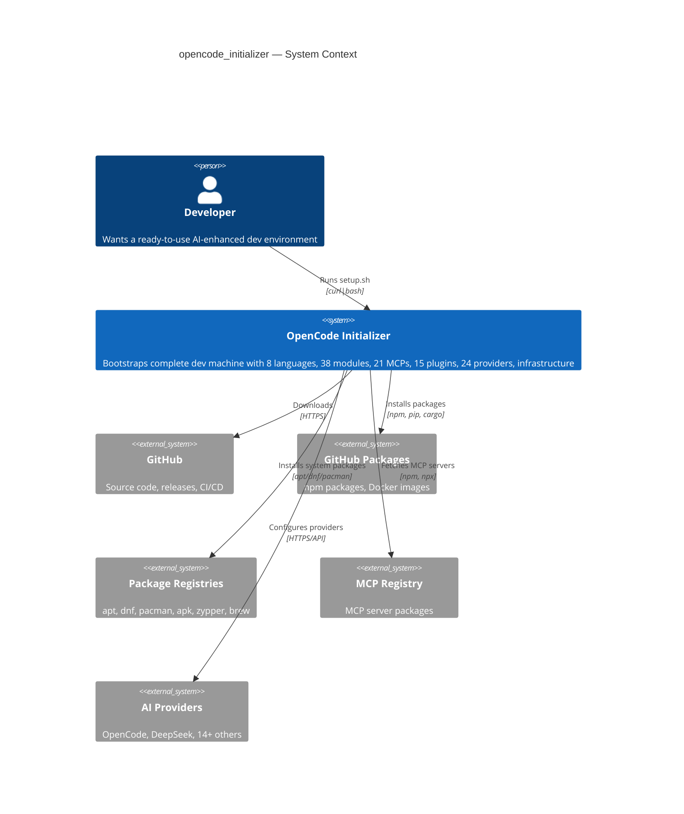
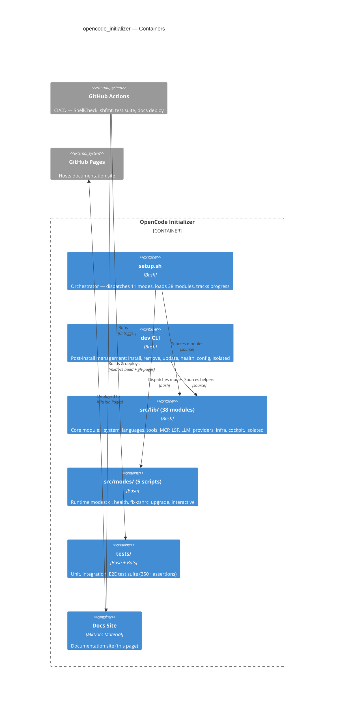
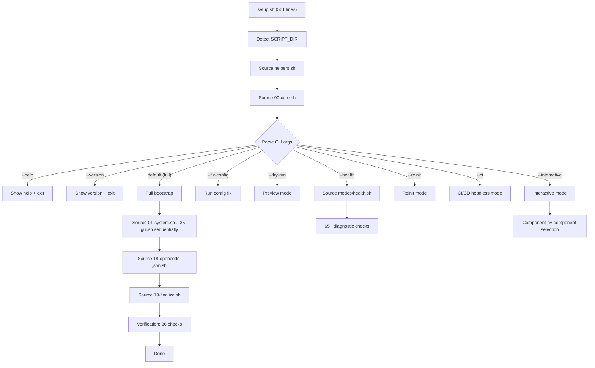
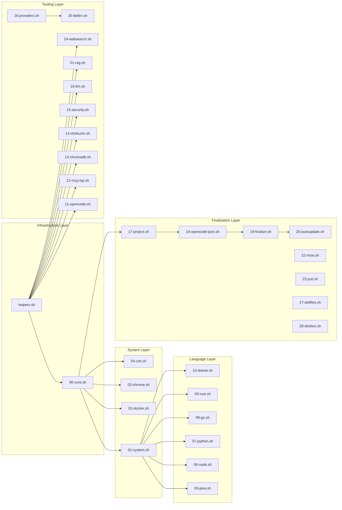

# Architecture

OpenCode Initializer follows a modular architecture: a lightweight **orchestrator** (`setup.sh`, 561 lines) that sources 38 **modules** and dispatches 11 **modes**.

## C4 Level 1: System Context

## C4 Level 2: Container Diagram

## C4 Level 3: Module Layout

```mermaid
C4Container
    title src/lib/ — 38 Module Layout

    Container_Boundary(modules, "src/lib/") {
        Container(helpers, "helpers.sh", "Bash", "_curl, _retry, _npm_install — shared infrastructure")
        Container(core, "00-core.sh", "Bash", "OS/PKG/ARCH detection, mirrors, progress tracking")

        Container(sys, "01-system.sh", "Bash", "System packages (cross-distro)")
        Container(docker, "02-docker.sh", "Bash", "Docker engine")
        Container(chrome, "03-chrome.sh", "Bash", "Google Chrome + chromedriver")
        Container(zsh, "04-zsh.sh", "Bash", "Zsh + Oh My Zsh + P10k + 14 plugins")

        Container(java, "05-java.sh", "Bash", "Java 25 (Adoptium) + Zig")
        Container(node, "06-node.sh", "Bash", "Node.js 24 (n)")
        Container(python, "07-python.sh", "Bash", "Python 3.14 + uv")
        Container(go, "08-go.sh", "Bash", "Go 1.26")
        Container(rust, "09-rust.sh", "Bash", "Rust 1.97.1 (rustup)")
        Container(dotnet, "10-dotnet.sh", "Bash", ".NET 10")

        Container(opencode, "11-opencode.sh", "Bash", "OpenCode CLI + Bun")
        Container(mcp, "12-mcp-lsp.sh", "Bash", "21 MCP servers + 15 plugins + 13 LSP")
        Container(chromadb, "13-chromadb.sh", "Bash", "ChromaDB + systemd")
        Container(shokunin, "14-shokunin.sh", "Bash", "Shokunin + Superpowers + Caveman")
        Container(sec, "15-security.sh", "Bash", "Trivy, Qodana")
        Container(llm, "16-llm.sh", "Bash", "Ollama, vLLM, SGLang, Open WebUI")

        Container(project, "17-project.sh", "Bash", "Project structure (AGENTS.md, WAL)")
        Container(json, "18-opencode-json.sh", "Bash", "opencode.json generation")
        Container(finalize, "19-finalize.sh", "Bash", "Git config, PATH, verification (36 checks)")
        Container(update, "20-autoupdate.sh", "Bash", "topgrade + systemd timer")
        Container(rag, "21-rag.sh", "Bash", "RAG system (optional)")

        Container(mise, "29-mise.sh", "Bash", "mise-en-place tool version manager")
        Container(webui, "22-webui-service.sh", "Bash", "Open WebUI systemd user service")
        Container(just, "23-just.sh", "Bash", "just task runner")
        Container(websearch, "24-websearch.sh", "Bash", "SearXNG web search + sanitizer")
        Container(litellm, "25-litellm.sh", "Bash", "LiteLLM OpenAI-compatible API gateway")
        Container(providers, "26-providers.sh", "Bash", "24 LLM provider registry")
        Container(dotfiles, "27-dotfiles.sh", "Bash", "chezmoi dotfiles manager")
        Container(devbox, "28-devbox.sh", "Bash", "Devbox Nix-based environments")

        Container(infra, "30-infra.sh", "Bash", "Infrastructure: PostgreSQL + Qdrant + Redis + Prometheus + Grafana + MemoryLayer")
        Container(cockpit, "31-cockpit.sh", "Bash", "Cockpit TUI server management daemon")
        Container(isolated, "32-isolated.sh", "Bash", "Isolated Circuit Mode — air-gapped LLM")
        Container(observ, "34-observability.sh", "Bash", "Grafana + Prometheus observability stack")
        Container(gui, "35-gui.sh", "Bash", "Web management interface")

        Container(vcheck, "version-check.sh", "Bash", "Version comparison (8+ tools)")
        Container(precheck, "pre-session-check.sh", "Bash", "Pre-session validation")
    }

    Rel(core, helpers, "Uses")
    Rel(sys, core, "Depends")
    Rel(java, core, "Depends")
    Rel(mcp, helpers, "Uses _curl/_npm_install")
    Rel(finalize, json, "Calls")
    Rel(project, core, "Depends")
    Rel(litellm, providers, "Depends")
```

## C4 Level 4: setup.sh Orchestrator Flow

## Module Dependency Map

## Key Design Decisions

| Decision | Rationale |
|----------|-----------|
| **Modular architecture** | Each language/tool isolated in its own module. Easy to add/remove/update. |
| **Progress tracking** | `~/.cache/opencode-setup/progress` records completed steps. Re-runs are idempotent. |
| **Adoptium API for Java** | GitHub-hosted CDN, reliable in WSL2 unlike sdkman.io |
| **npm pack cache for MCP** | `.tgz` files cached locally, survive re-runs |
| **All curl via _curl()** | 5 retries, exponential backoff, 24h cache |
| **All npm via _npm_install()** | npm pack -> bun fallback |
| **WSL2 DNS fix** | Adds 8.8.8.8 + 1.1.1.1 to /etc/resolv.conf |
| **No secrets in code** | All API keys via CLI arguments only |
| **Bun binary paths for MCP** | Absolute paths to `~/.bun/bin/` instead of `npx -y`, instant cold start |
| **Auto-update via systemd** | topgrade runs weekly (Sun 04:00), unattended-upgrades for daily security |
| **Hardware auto-detection** | NVIDIA/AMD/Intel GPU, NPU, Apple Silicon — zero-config LLM runtime setup |
| **Multi-provider** | 24 LLM providers (20 cloud + 4 local) with dynamic registration and session switching |
| **Infrastructure as Code** | PostgreSQL + Qdrant + Redis + Prometheus + Grafana + MemoryLayer via Docker Compose |
| **Isolated Circuit Mode** | Air-gapped LLM operation with local OpenAI-compatible backends |
| **Cockpit TUI** | 7-tab terminal UI for server management |

---

**See also:**
- [Reference](../reference/) — CLI reference and module table
- [MCP, LSP & Plugins](../reference/mcp-lsp-plugins/) — full component catalogue
- [User Guide](../user-guide/) — daily usage patterns
- [Advanced Guide](../advanced/) — customization and optimization
