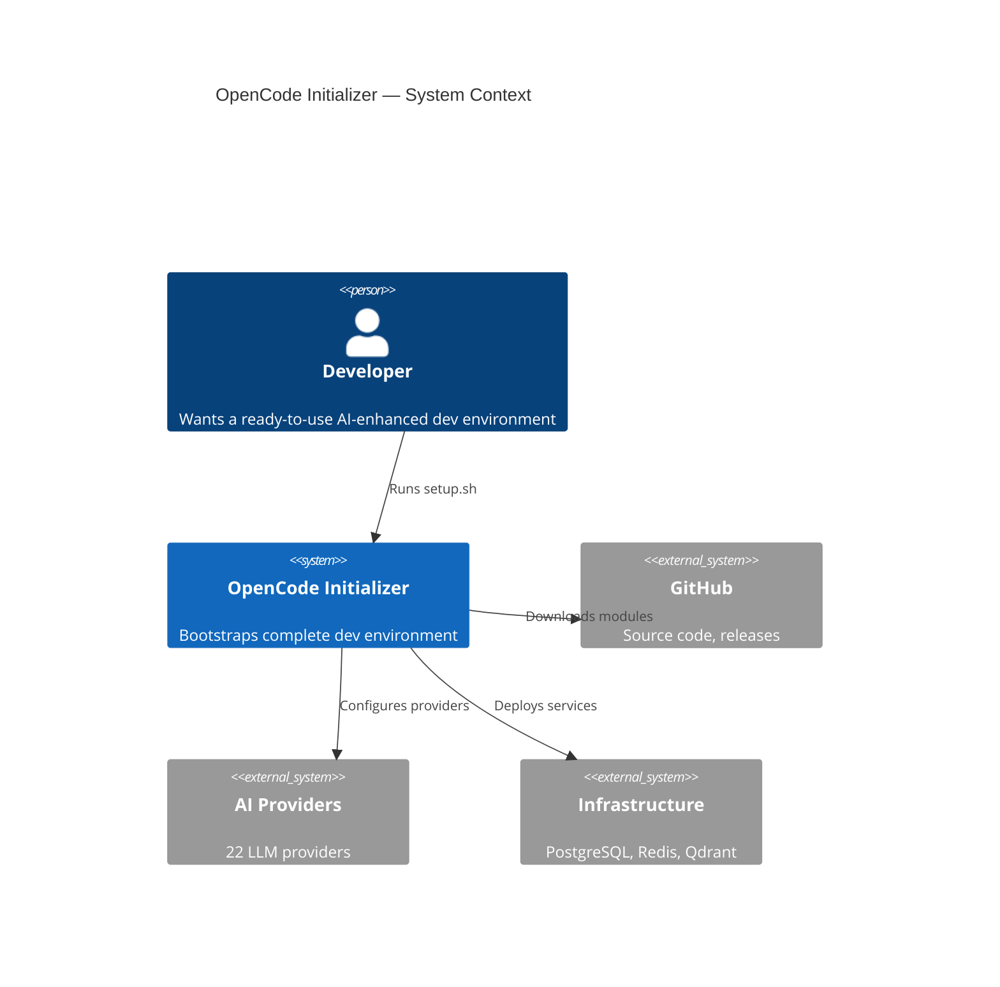
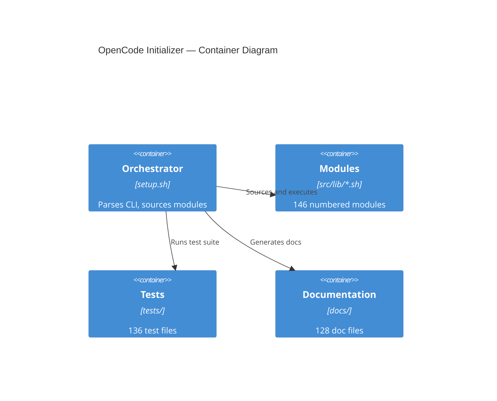

# Architecture Overview

## System Context

OpenCode Initializer is a one-command, AI-native bootstrap for development machines.

```mermaid
C4Context
    title OpenCode Initializer — System Context
    
    Person(dev, "Developer", "Wants a ready-to-use AI-enhanced dev environment")
    System(oci, "OpenCode Initializer", "Bootstraps complete dev environment")
    
    System_Ext(gh, "GitHub", "Source code, releases")
    System_Ext(ai, "AI Providers", "22 LLM providers")
    System_Ext(infra, "Infrastructure", "PostgreSQL, Redis, Qdrant")
    
    Rel(dev, oci, "Runs setup.sh")
    Rel(oci, gh, "Downloads modules")
    Rel(oci, ai, "Configures providers")
    Rel(oci, infra, "Deploys services")
```

## Container Diagram

```mermaid
C4Container
    title OpenCode Initializer — Container Diagram
    
    Container(orch, "Orchestrator", "setup.sh", "Parses CLI, sources modules")
    Container(modules, "Modules", "src/lib/*.sh", "146 numbered modules")
    Container(tests, "Tests", "tests/", "136 test files")
    Container(docs, "Documentation", "docs/", "128 doc files")
    
    Rel(orch, modules, "Sources and executes")
    Rel(orch, tests, "Runs test suite")
    Rel(orch, docs, "Generates docs")
```

## Module Map

| Range | Responsibility |
|-------|----------------|
| `00-core.sh` | Version, OS detection, package manager abstraction |
| `01–10` | System packages, Docker, Chrome, ZSH, languages |
| `11–19` | OpenCode CLI, MCP/LSP/plugins, ChromaDB |
| `20–29` | Auto-update, RAG, WebUI, providers, dotfiles |
| `30–36` | Infrastructure, Cockpit, observability |
| `37–40` | WAL, IDE plugins, best practices |
| `41–51` | Governance, audit, PII, offline bundle |
| `52–60` | Context engine, skills, task distribution |
| `99` | Upstream sync |

## Related Documentation

- [Agent System](agent-system.en.md) — Multi-agent architecture
- [LLM Fundamentals](llm-fundamentals-2026.md) — LLM basics and optimization
- [AIPDLC Integration](aipdlc-integration-guide.md) — Development lifecycle