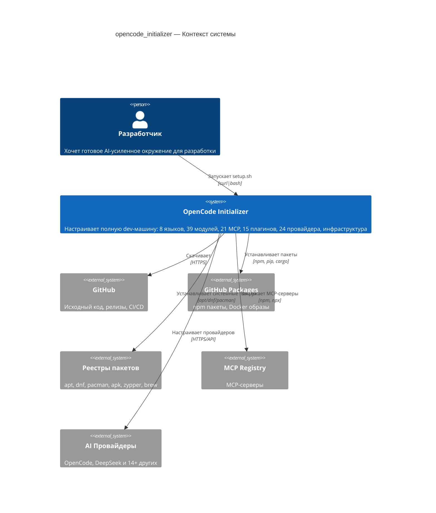
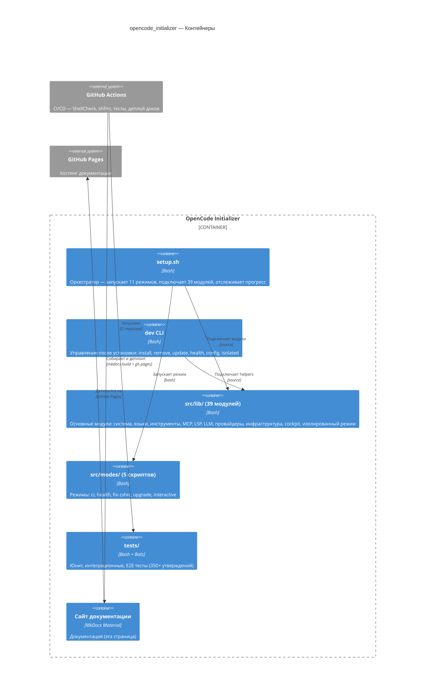
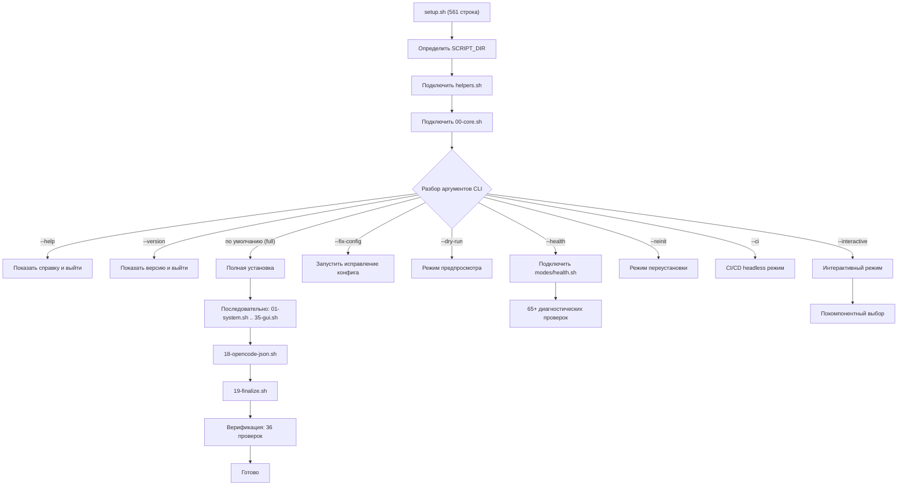
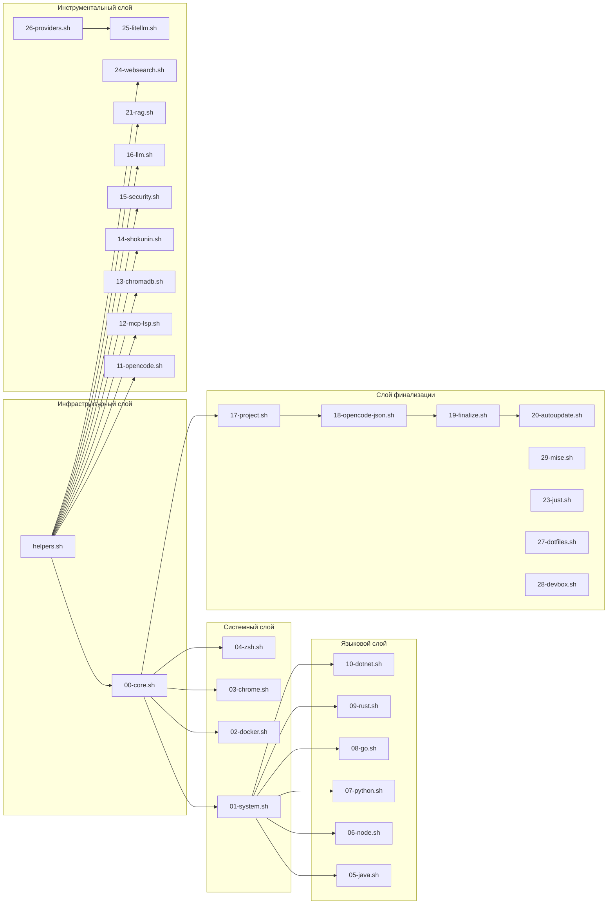

# Архитектура

OpenCode Initializer построен на модульной архитектуре: лёгкий **оркестратор** (`setup.sh`, 561 строка), который подключает 39 **модулей** и запускает 11 **режимов**.

## C4 Уровень 1: Контекст системы

## C4 Уровень 2: Контейнеры

## C4 Уровень 3: Схема модулей

```mermaid
C4Container
    title src/lib/ — 39 модулей

    Container_Boundary(modules, "src/lib/") {
        Container(helpers, "helpers.sh", "Bash", "_curl, _retry, _npm_install — общая инфраструктура")
        Container(core, "00-core.sh", "Bash", "Определение ОС/ПМ/архитектуры, зеркала, прогресс")

        Container(sys, "01-system.sh", "Bash", "Системные пакеты (кросс-дистрибутив)")
        Container(docker, "02-docker.sh", "Bash", "Docker Engine")
        Container(chrome, "03-chrome.sh", "Bash", "Google Chrome + chromedriver")
        Container(zsh, "04-zsh.sh", "Bash", "Zsh + Oh My Zsh + P10k + 14 плагинов")

        Container(java, "05-java.sh", "Bash", "Java 25 (Adoptium) + Zig")
        Container(node, "06-node.sh", "Bash", "Node.js 24 (n)")
        Container(python, "07-python.sh", "Bash", "Python 3.14 + uv")
        Container(go, "08-go.sh", "Bash", "Go 1.26")
        Container(rust, "09-rust.sh", "Bash", "Rust 1.96 (rustup)")
        Container(dotnet, "10-dotnet.sh", "Bash", ".NET 10")

        Container(opencode, "11-opencode.sh", "Bash", "OpenCode CLI + Bun")
        Container(mcp, "12-mcp-lsp.sh", "Bash", "21 MCP + 15 плагинов + 13 LSP")
        Container(chromadb, "13-chromadb.sh", "Bash", "ChromaDB + systemd")
        Container(shokunin, "14-shokunin.sh", "Bash", "Shokunin + Superpowers + Caveman")
        Container(sec, "15-security.sh", "Bash", "Trivy, Qodana")
        Container(llm, "16-llm.sh", "Bash", "Ollama, vLLM, SGLang, Open WebUI")

        Container(project, "17-project.sh", "Bash", "Структура проекта (AGENTS.md, WAL)")
        Container(json, "18-opencode-json.sh", "Bash", "Генерация opencode.json")
        Container(finalize, "19-finalize.sh", "Bash", "Git config, PATH, верификация (36 проверок)")
        Container(update, "20-autoupdate.sh", "Bash", "topgrade + systemd таймер")
        Container(rag, "21-rag.sh", "Bash", "RAG система (опционально)")

        Container(webui, "22-webui-service.sh", "Bash", "Open WebUI systemd сервис")
        Container(just, "23-just.sh", "Bash", "just — таск-раннер")
        Container(websearch, "24-websearch.sh", "Bash", "SearXNG веб-поиск + sanitizer")
        Container(litellm, "25-litellm.sh", "Bash", "LiteLLM OpenAI-совместимый API-шлюз")
        Container(providers, "26-providers.sh", "Bash", "Реестр 24 LLM-провайдеров")
        Container(dotfiles, "27-dotfiles.sh", "Bash", "chezmoi — менеджер dotfiles")
        Container(devbox, "28-devbox.sh", "Bash", "Devbox — Nix-окружения")
        Container(mise, "29-mise.sh", "Bash", "mise-en-place — менеджер версий инструментов")

        Container(infra, "30-infra.sh", "Bash", "Инфраструктура: PostgreSQL + Qdrant + Redis + Prometheus + Grafana + MemoryLayer")
        Container(cockpit, "31-cockpit.sh", "Bash", "Cockpit TUI — демон управления сервером")
        Container(isolated, "32-isolated.sh", "Bash", "Изолированный контур — автономные LLM без сети")
        Container(observ, "34-observability.sh", "Bash", "Grafana + Prometheus — стек наблюдаемости")
        Container(gui, "35-gui.sh", "Bash", "Веб-интерфейс управления")
        Container(router, "36-model-router.sh", "Bash", "Model Router — подбор модели под задачу")

        Container(vcheck, "version-check.sh", "Bash", "Сравнение версий (8+ инструментов)")
        Container(precheck, "pre-session-check.sh", "Bash", "Предсессионная валидация")
    }

    Rel(core, helpers, "Использует")
    Rel(sys, core, "Зависит")
    Rel(java, core, "Зависит")
    Rel(mcp, helpers, "Использует _curl/_npm_install")
    Rel(finalize, json, "Вызывает")
    Rel(project, core, "Зависит")
    Rel(litellm, providers, "Зависит")
```

## C4 Уровень 4: Поток выполнения setup.sh

## Карта зависимостей модулей

## Ключевые архитектурные решения

| Решение | Обоснование |
|---------|-------------|
| **Модульная архитектура** | Каждый язык/инструмент изолирован в собственном модуле. Легко добавлять, удалять и обновлять |
| **Отслеживание прогресса** | `~/.cache/opencode-setup/progress` запоминает выполненные шаги. Повторные запуски идемпотентны |
| **Adoptium API для Java** | GitHub-хостинг CDN, надёжен в WSL2 в отличие от sdkman.io |
| **npm pack кэш для MCP** | `.tgz` файлы кэшируются локально, переживают повторные запуски |
| **Весь curl через _curl()** | 5 попыток, экспоненциальная задержка, кэш 24ч |
| **Весь npm через _npm_install()** | npm pack → bun fallback |
| **WSL2 DNS fix** | Добавляет 8.8.8.8 + 1.1.1.1 в /etc/resolv.conf |
| **Нет секретов в коде** | Все API ключи только через аргументы CLI |
| **Bun binary paths для MCP** | Абсолютные пути к `~/.bun/bin/` вместо `npx -y`, мгновенный холодный старт |
| **Автообновление через systemd** | topgrade еженедельно (Вс 04:00), unattended-upgrades ежедневно для безопасности |
| **Автоопределение оборудования** | NVIDIA/AMD/Intel GPU, NPU, Apple Silicon — настройка LLM без конфигурации |
| **Мульти-провайдер** | 24 LLM-провайдера (20 облачных + 4 локальных) с динамической регистрацией и переключением сессий |
| **Инфраструктура как код** | PostgreSQL + Qdrant + Redis + Prometheus + Grafana + MemoryLayer через Docker Compose |
| **Изолированный контур** | Автономная работа LLM с локальными OpenAI-совместимыми бэкендами |
| **Cockpit TUI** | 7-вкладочный терминальный интерфейс управления сервером |
| **z.ai GLM-5.2 интеграция** | Основной провайдер для RU/CN рынка, OpenAI-совместимый API |
| **OpenRouter агрегатор** | Единый API-ключ для 100+ моделей |
| **Model Router** | Подбор модели под задачу по 8 профилям (coding, reasoning, fast, agentic, budget, vision, isolated, ru_cn) |

---

**См. также:**
- [Справочник](../reference/) — CLI и таблица модулей
- [MCP, LSP и плагины](../reference/mcp-lsp-plugins/) — полный каталог
- [Руководство](../user-guide/) — повседневное использование
- [Продвинутое](../advanced/) — кастомизация и оптимизация
