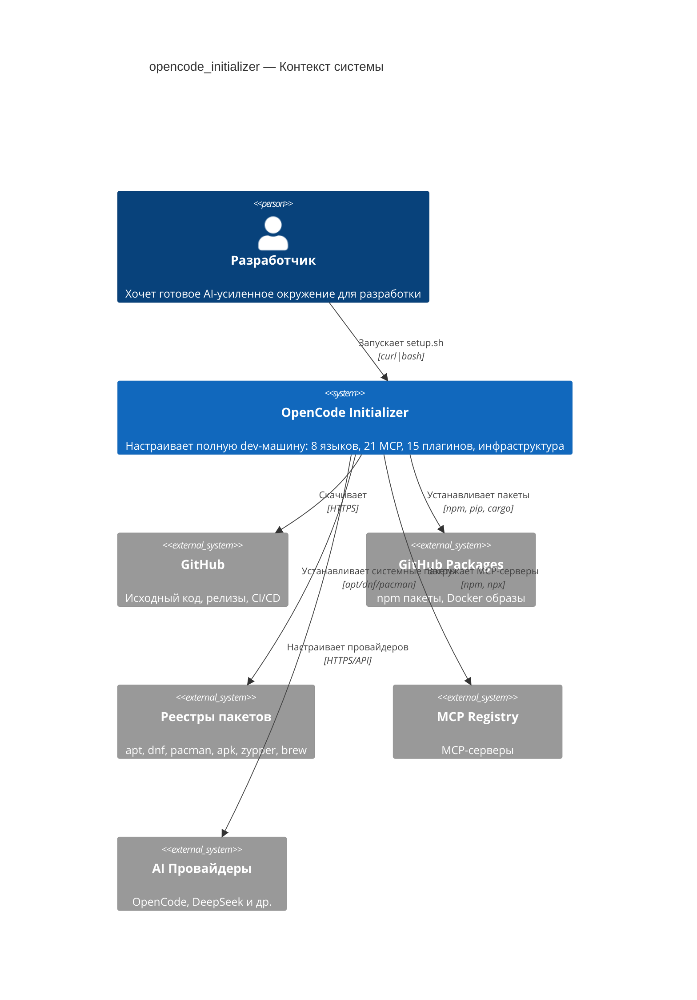
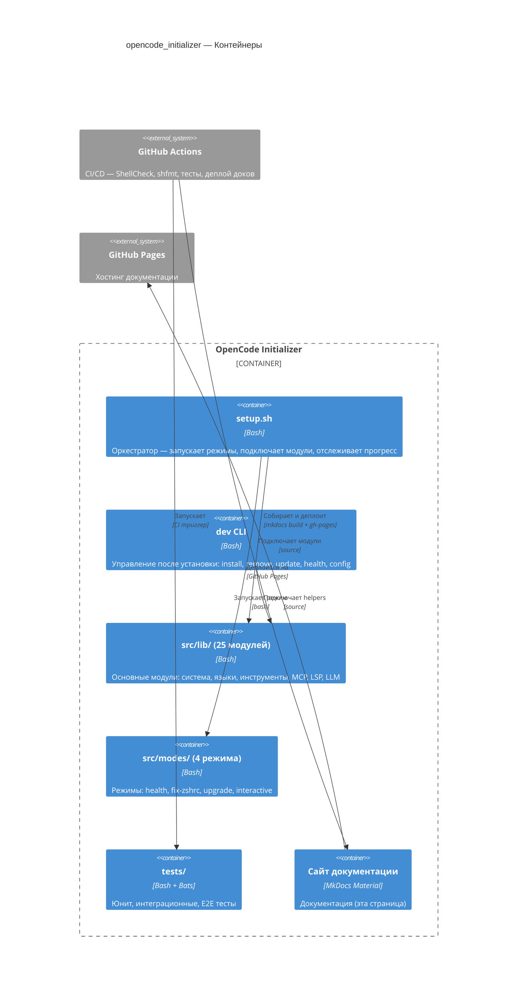
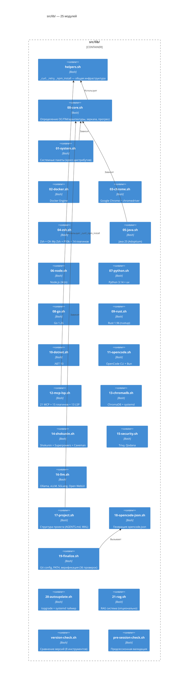
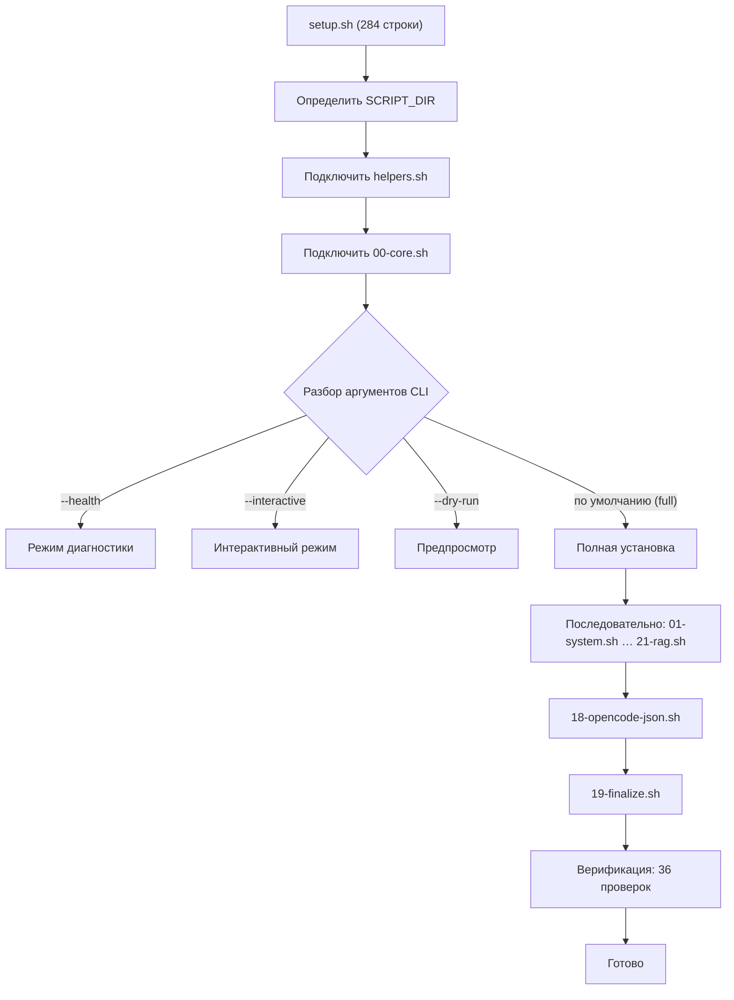
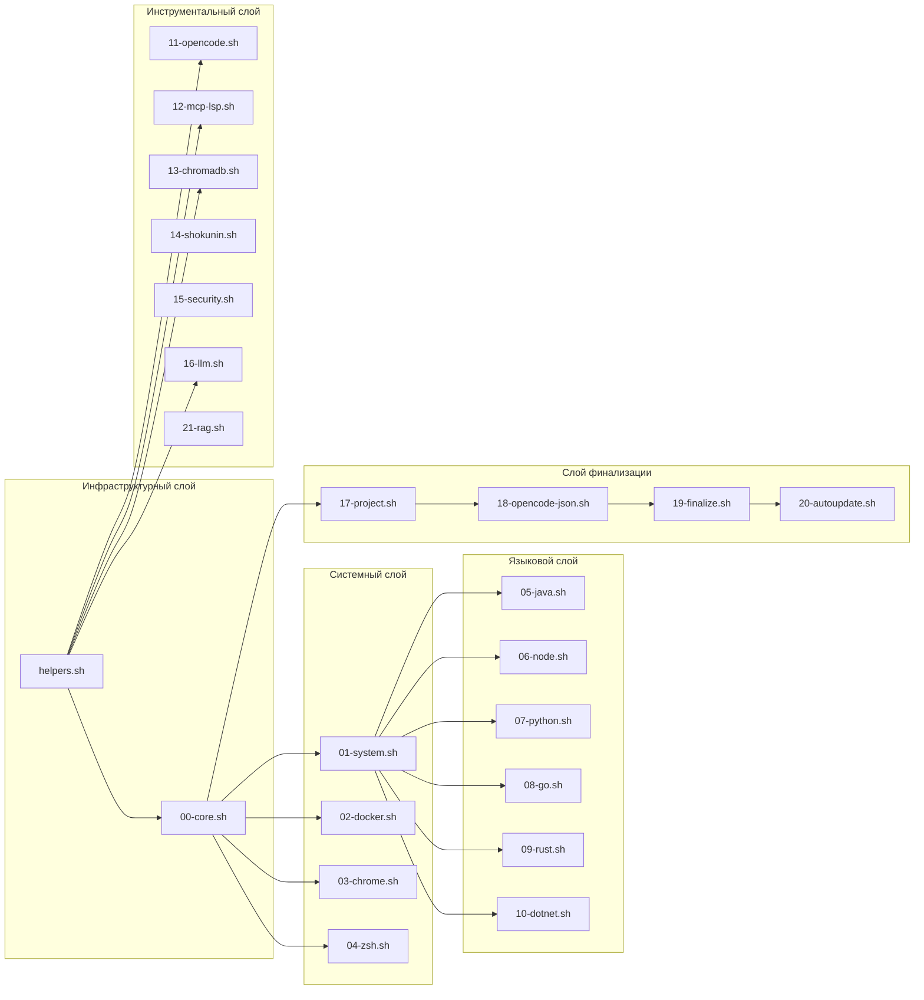

# Архитектура

OpenCode Initializer построен на модульной архитектуре: лёгкий **оркестратор** (`setup.sh`, 284 строки), который подключает 25 **модулей** и запускает 4 **режимных скрипта**.

## C4 Уровень 1: Контекст системы

## C4 Уровень 2: Контейнеры

## C4 Уровень 3: Схема модулей

## Поток выполнения setup.sh

## Карта зависимостей модулей

## Ключевые архитектурные решения

| Решение | Обоснование |
|---------|-------------|
| **Модульная архитектура** | Каждый язык/инструмент изолирован. Легко добавлять/удалять/обновлять |
| **Отслеживание прогресса** | `~/.cache/opencode-setup/progress` запоминает выполненные шаги. Повторные запуски идемпотентны |
| **Adoptium API для Java** | GitHub CDN, надёжен в WSL2 в отличие от sdkman.io |
| **npm pack кэш для MCP** | `.tgz` файлы кэшируются локально, переживают повторные запуски |
| **Весь curl через _curl()** | 5 попыток, экспоненциальная задержка, кэш 24ч |
| **Весь npm через _npm_install()** | npm pack → bun fallback |
| **WSL2 DNS fix** | Добавляет 8.8.8.8 + 1.1.1.1 в /etc/resolv.conf |
| **Нет секретов в коде** | Все API ключи только через аргументы CLI |
| **Bun binary paths для MCP** | Абсолютные пути к `~/.bun/bin/` вместо `npx -y`, мгновенный холодный старт |
| **Автообновление через systemd** | topgrade еженедельно (Вс 04:00), unattended-upgrades ежедневно |
| **Логирование установки** | `tee` в `~/.cache/opencode-setup/setup-YYYYMMDD-HHMMSS.log` |
