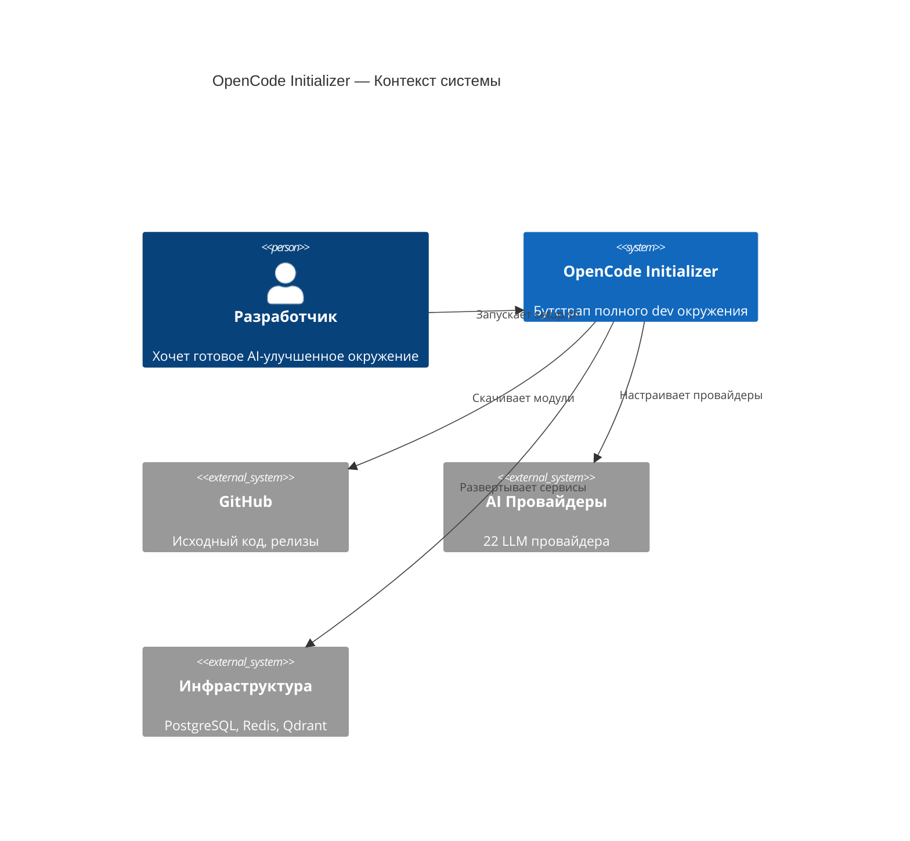
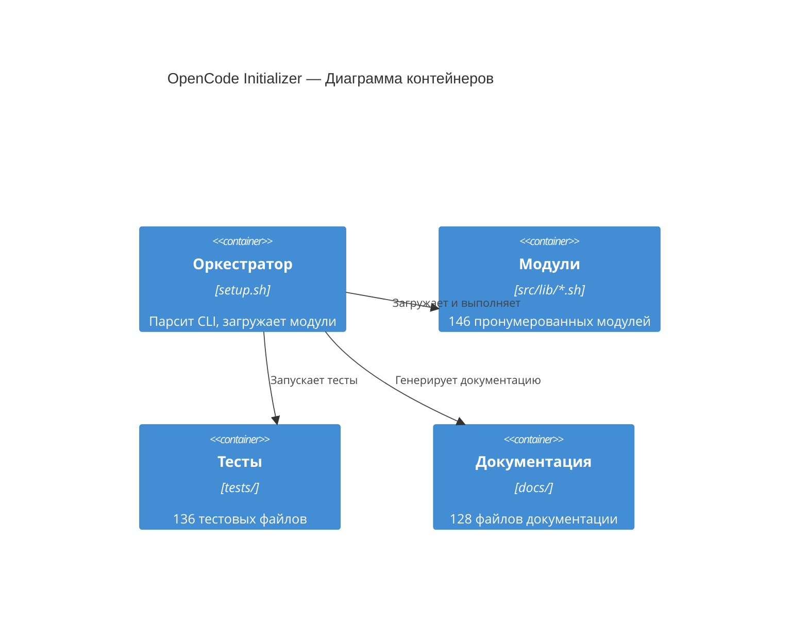

# Обзор архитектуры

## Контекст системы

OpenCode Initializer — это одно-командный, AI-нативный бутстрап для development машин.

```mermaid
C4Context
    title OpenCode Initializer — Контекст системы
    
    Person(dev, "Разработчик", "Хочет готовое AI-улучшенное окружение")
    System(oci, "OpenCode Initializer", "Бутстрап полного dev окружения")
    
    System_Ext(gh, "GitHub", "Исходный код, релизы")
    System_Ext(ai, "AI Провайдеры", "22 LLM провайдера")
    System_Ext(infra, "Инфраструктура", "PostgreSQL, Redis, Qdrant")
    
    Rel(dev, oci, "Запускает setup.sh")
    Rel(oci, gh, "Скачивает модули")
    Rel(oci, ai, "Настраивает провайдеры")
    Rel(oci, infra, "Развертывает сервисы")
```

## Диаграмма контейнеров

```mermaid
C4Container
    title OpenCode Initializer — Диаграмма контейнеров
    
    Container(orch, "Оркестратор", "setup.sh", "Парсит CLI, загружает модули")
    Container(modules, "Модули", "src/lib/*.sh", "146 пронумерованных модулей")
    Container(tests, "Тесты", "tests/", "136 тестовых файлов")
    Container(docs, "Документация", "docs/", "128 файлов документации")
    
    Rel(orch, modules, "Загружает и выполняет")
    Rel(orch, tests, "Запускает тесты")
    Rel(orch, docs, "Генерирует документацию")
```

## Карта модулей

| Диапазон | Ответственность |
|----------|----------------|
| `00-core.sh` | Версия, определение ОС, абстракция пакетного менеджера |
| `01–10` | Системные пакеты, Docker, Chrome, ZSH, языки |
| `11–19` | OpenCode CLI, MCP/LSP/plugins, ChromaDB |
| `20–29` | Авто-обновление, RAG, WebUI, провайдеры, dotfiles |
| `30–36` | Инфраструктура, Cockpit, наблюдаемость |
| `37–40` | WAL, IDE plugins, лучшие практики |
| `41–51` | Governance, аудит, PII, офлайн бандл |
| `52–60` | Context engine, навыки, распределение задач |
| `99` | Синхронизация upstream |

## Связанная документация

- [Система агентов](agent-system.ru.md) — многоагентная архитектура
- [Основы LLM](llm-fundamentals-2026.md) — основы LLM и оптимизация
- [Интеграция AIPDLC](aipdlc-integration-guide.md) — жизненный цикл разработки