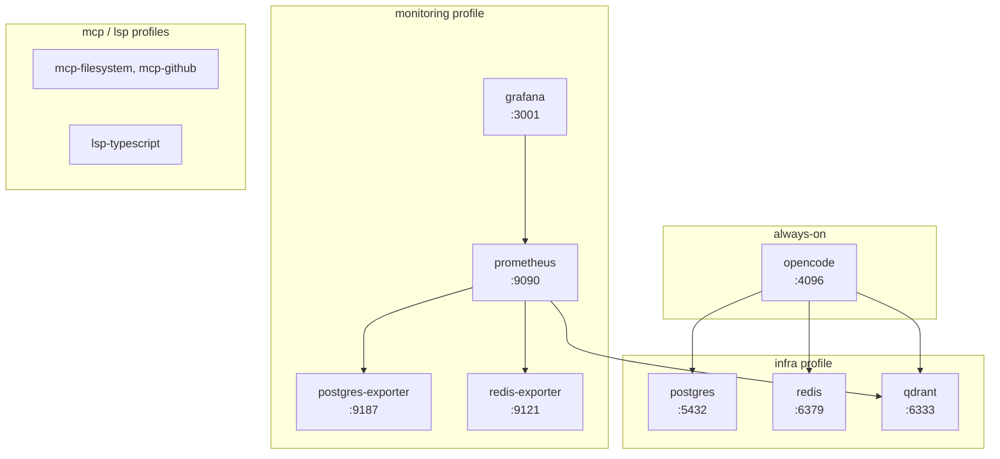

# OpenCode Initializer — Container Deployment

Container-based deployment of **opencode_initializer**: a one-command, AI-native bootstrap
for development machines that installs and wires 6 language toolchains, Docker infrastructure,
24 MCP servers, 12 LSP servers, 21 OpenCode plugins, and 22 LLM providers into a governed,
auditable agent harness.

This guide covers building and running the multi-stage container image, deploying the full
multi-profile Compose stack, configuration, hardening, development workflows, production
operations, and troubleshooting.

> **Scope.** This document describes the *container* delivery path. For the bare-metal
> orchestrator, see `setup.sh` and [`docs/getting-started/`](../getting-started/index.md). For the
> post-install CLI, see `dev.sh` and [`docs/cli.md`](../cli.md).

---

## Contents

1. [Quick Start](#1-quick-start)
2. [Deployment Profiles](#2-deployment-profiles)
3. [Configuration](#3-configuration)
4. [Security](#4-security)
5. [Development](#5-development)
6. [Production](#6-production)
7. [Troubleshooting](#7-troubleshooting)

---

## 1. Quick Start

### 1.1 Docker installation

The image and Compose stack require Docker Engine **20.10+** with the Compose **v2** plugin
(`docker compose`, not the legacy `docker-compose`). BuildKit is used for multi-stage builds
and is enabled by default in modern Docker.

**Linux (Debian/Ubuntu)**

```bash
curl -fsSL https://get.docker.com | sh
sudo usermod -aG docker "$USER"          # log out and back in
docker --version                         # Docker version 24+
docker compose version                   # Docker Compose version v2+
```

**macOS (best-effort)** — install Docker Desktop, then enable BuildKit (default) and the
Compose plugin. Containerized infra is best-effort; see the bare-metal caveats in
[`README.md`](https://github.com/AlexanderNarbaev/opencode_initializer/blob/main/README.md).

**Windows (WSL2)** — install Docker Desktop with the WSL2 backend. The container runs
Linux-native; Windows-native is unsupported.

Verify:

```bash
docker run --rm hello-world
```

### 1.2 Building the image

The `Dockerfile` is a **two-stage** build: toolchains and Node.js globals are assembled in a
`builder` stage (`node:20-bookworm-slim`), then copied into a slim runtime image running as
the non-root `opencode` user.

```bash
# Standard build
docker build -t opencode-initializer:latest .

# Or use the provided helper (adds --tag/--push/--registry/--build-arg handling)
./scripts/container-build.sh --tag v15.0.0
```

| Stage | Base image | Contents |
|-------|------------|----------|
| `builder` | `node:20-bookworm-slim` | Go 1.26, Rust (stable), .NET 10, Java 17 JRE, Python 3, `opencode-ai`, `@colbymchenry/codegraph` |
| runtime | `node:20-bookworm-slim` | toolchains relocated to `/usr/local/*`, `docker.io` CLI, non-root user |

The final image ships the `opencode` CLI as its entrypoint (see [§1.3](#13-running-the-container)).

### 1.3 Running the container

The image entrypoint starts the OpenCode web server on port **4096**:

```bash
# Foreground
docker run --rm -p 4096:4096 opencode-initializer:latest

# Detached, with a named volume for state
docker run -d \
  --name opencode \
  -p 4096:4096 \
  -v opencode-data:/home/opencode/.local/share/opencode \
  -v "$PWD:/workspace" \
  -w /workspace \
  opencode-initializer:latest
```

Entrypoint (from `Dockerfile`):

```dockerfile
ENTRYPOINT ["opencode", "web", "--hostname", "0.0.0.0", "--port", "4096"]
```

For the full stack (with databases, monitoring, MCP, LSP), prefer Compose — see
[§2](#2-deployment-profiles).

### 1.4 Accessing the web UI

| Service | URL | Notes |
|---------|-----|-------|
| OpenCode web UI | <http://localhost:4096> | container entrypoint |
| Web GUI (management) | <http://localhost:4200> | `src/gui/server.js`, run via `dev gui` |
| Grafana | <http://localhost:3001> | mapped from container port 3000 |
| Prometheus | <http://localhost:9090> | |
| Qdrant | <http://localhost:6333> | REST/gRPC on 6334 |

Health endpoint:

```bash
curl -fsS http://localhost:4096/health
```

The container declares a `HEALTHCHECK` (`curl -fsS http://localhost:4096/health`) with a
30s interval, 10s timeout, 5s start period, and 3 retries. In Compose, the `opencode`
service's health is used by dependent services.

---

## 2. Deployment Profiles

The Compose stack (`docker-compose.yml`) defines five **profiles** layered on top of an
always-on `opencode` application tier:



### 2.1 Default (opencode only)

No profile flag — starts only the application tier:

```bash
docker compose up -d opencode
# or simply (no infra/monitoring containers):
docker compose up -d
```

### 2.2 Infrastructure

PostgreSQL 17, Redis 7, and Qdrant (vector DB) with persistent volumes and health checks:

```bash
docker compose --profile infra up -d
```

| Service | Image | Port | Volume |
|---------|-------|------|--------|
| `postgres` | `postgres:17-alpine` | 5432 | `postgres-data` |
| `redis` | `redis:7-alpine` (AOF on) | 6379 | `redis-data` |
| `qdrant` | `qdrant/qdrant:latest` | 6333/6334 | `qdrant-data` |

The `opencode` service declares `depends_on` with `required: false` for all three, so it
starts even if the infra profile is not selected.

### 2.3 Monitoring

Prometheus, Grafana, and DB metrics exporters:

```bash
docker compose --profile monitoring up -d
```

- **Prometheus** scrapes `opencode:9464` (host metrics), `postgres-exporter:9187`,
  `redis-exporter:9121`, and Qdrant's native `/metrics` (see
  [`src/grafana/prometheus.yml`](https://github.com/AlexanderNarbaev/opencode_initializer/blob/main/src/grafana/prometheus.yml)).
- **Grafana** is provisioned from `src/grafana/provisioning/` and ships the
  `agent-performance` and `infrastructure-overview` dashboards.

### 2.4 Full (all services)

```bash
docker compose --profile full up -d
```

Equivalent to enabling `infra`, `monitoring`, `mcp`, and `lsp` together.

### 2.5 MCP servers

```bash
docker compose --profile mcp up -d
```

- `mcp-filesystem` — `@modelcontextprotocol/server-filesystem /workspace` (mounts `./dev`)
- `mcp-github` — `@modelcontextprotocol/server-github`, requires `GITHUB_TOKEN`

> **Note.** These are reference containers. In production, MCP servers are normally spawned
> by the OpenCode client in-process or via stdio, as configured in `opencode.json`.

### 2.6 LSP servers

```bash
docker compose --profile lsp up -d
```

- `lsp-typescript` — `typescript-language-server --stdio`

> **Note.** LSP servers run as subprocesses inside the `opencode` container (spawned by the
> client over stdio). This container exists only as a scaffold for remote/isolated LSP setups.

---

## 3. Configuration

### 3.1 Environment variables

Copy `.env.example` to `.env` and fill in secrets. Compose interpolates the following
documented variables automatically.

**Application tier** (set in `docker-compose.yml`):

| Variable | Default | Purpose |
|----------|---------|---------|
| `OPENCODE_STRICT_VALIDATION` | `false` | relax config validation |
| `NODE_TLS_REJECT_UNAUTHORIZED` | `0` | allow self-signed certs in dev (see [§4](#4-security)) |
| `POSTGRES_HOST` / `POSTGRES_PORT` | `postgres` / `5432` | database endpoint |
| `REDIS_HOST` / `REDIS_PORT` | `redis` / `6379` | cache endpoint |
| `QDRANT_HOST` / `QDRANT_PORT` | `qdrant` / `6333` | vector DB endpoint |

**Infrastructure & secrets** (provide via `.env`):

```bash
POSTGRES_PASSWORD=change-me-strong-password   # default: opencode
GRAFANA_PASSWORD=change-me-admin-password     # default: admin
GITHUB_TOKEN=ghp_...                          # for mcp-github
```

**LLM providers** (from `.env.example`, injected at runtime):

```bash
DEEPSEEK_API_KEY=sk-...
OPENAI_API_KEY=
ANTHROPIC_API_KEY=
GOOGLE_API_KEY=
# ... 22 providers total
```

**Isolated Circuit** (local-only LLM backend, canonical `OPENCODE_*` prefix):

```bash
OPENCODE_LOCAL_ENDPOINT=http://localhost:11434/v1
OPENCODE_LOCAL_MODEL=qwen3:0.6b
OPENCODE_ISOLATED_CIRCUIT=false
```

Override at runtime:

```bash
docker run -d -p 4096:4096 \
  -e DEEPSEEK_API_KEY=sk-... \
  -e OPENCODE_ISOLATED_CIRCUIT=true \
  opencode-initializer:latest
```

### 3.2 Volume mounts

**Named volumes** (managed by Docker, persistent across container restarts):

| Volume | Service | Purpose |
|--------|---------|---------|
| `opencode-data` | opencode | `~/.local/share/opencode` state |
| `postgres-data` | postgres | database files |
| `redis-data` | redis | AOF + RDB snapshots |
| `qdrant-data` | qdrant | vector storage |
| `prometheus-data` | prometheus | TSDB |
| `grafana-data` | grafana | dashboards/users |

**Bind mounts** (host files into the container):

```bash
docker run -d \
  -v "$PWD/opencode.json:/home/opencode/.config/opencode/opencode.json" \
  -v "$PWD:/workspace" \
  opencode-initializer:latest
```

The Compose stack bind-mounts `./opencode/opencode.json` and `./dev:/workspace` into the
`opencode` service. Inspect and manage volumes:

```bash
docker volume ls
docker volume inspect opencode_postgres-data
docker volume prune      # DANGER: deletes unused volumes
```

### 3.3 Configuration files

| File | Container path | Purpose |
|------|----------------|---------|
| `opencode.json` | `/home/opencode/.config/opencode/opencode.json` | providers, MCP registry, routing |
| `src/grafana/prometheus.yml` | `/etc/prometheus/prometheus.yml` | scrape config |
| `src/grafana/provisioning/datasources/*` | `/etc/grafana/provisioning/datasources/*` | Grafana data sources |
| `src/grafana/provisioning/dashboards/*` | `/etc/grafana/provisioning/dashboards/*` | dashboard providers |
| `src/grafana/dashboards/*` | `/etc/grafana/dashboards/*` | dashboard JSON |

The data SSOT is `src/data/providers.json`, `mcp-profiles.json`, and `routing.json`, which
render into `opencode.json` (modules `26-providers.sh` / `18-opencode-json.sh`).

### 3.4 Secrets management

- **Never bake secrets into the image.** Use environment variables or a bind-mounted
  `.env` at runtime. `.env` is gitignored; set file permissions to `600`.
- For orchestrator-based deployments, use Docker secrets in Swarm or a secret manager
  (Vault, SOPS, `pass`). The container itself has no secret plumbing beyond env vars.
- `docker compose config` renders interpolated values — avoid echoing it in CI logs.
- Pre-commit and CI scan for key patterns; redact secrets in logs with `***`.

```bash
# Prefer runtime env over image layers
printf 'sk-...' | docker secret create deepseek_api_key -
docker service create --secret deepseek_api_key opencode-initializer
```

---

## 4. Security

### 4.1 Non-root user

The image creates and switches to the `opencode` user (`UID` 1000) before the entrypoint:

```dockerfile
RUN useradd -m -s /bin/bash opencode \
    && chown -R opencode:opencode /usr/local/cargo /usr/local/rustup
USER opencode
```

Toolchains are relocated out of `/root` (`/usr/local/go`, `/usr/local/cargo`,
`/usr/local/rustup`, `/usr/local/dotnet`) so the unprivileged user can read them. To run as
a different UID in production:

```bash
docker run --user 10001:10001 opencode-initializer:latest
```

### 4.2 Network isolation

Three bridge networks separate traffic:

```yaml
networks:
  opencode-network:   # application tier + MCP/LSP
  data-network:       # databases (postgres/redis/qdrant)
  monitoring-network: # prometheus/grafana/exporters
```

Recommendations:

- Do **not** publish database ports (`5432`, `6379`, `6333`) unless explicitly needed —
  they are reachable over `data-network` internally. Remove the `ports:` blocks or bind to
  `127.0.0.1` in production.
- Enable an internal-only `data-network` (`internal: true`) when no host access is required.
- Place the stack behind a reverse proxy (Traefik/Caddy/nginx) with TLS termination.

```bash
# Bind database ports to loopback only
docker compose -f docker-compose.yml \
  -f docker-compose.prod.yml up -d   # prod override sets 127.0.0.1 bindings
```

### 4.3 Secret management

See [§3.4](#34-secrets-management). Additional guidance:

- Set `NODE_TLS_REJECT_UNAUTHORIZED=1` (or remove the override) in production — the image
  defaults it to `0` for dev convenience only.
- Rotate `POSTGRES_PASSWORD` and `GRAFANA_PASSWORD`; never use the Compose defaults.
- Grant the `GITHUB_TOKEN` used by `mcp-github` the minimal scopes required.

### 4.4 Security scanning

Scan images before promotion:

```bash
# Trivy (blocking on CRITICAL in CI)
trivy image --severity CRITICAL opencode-initializer:latest

# Grype
grype opencode-initializer:latest

# Docker Scout
docker scout cves opencode-initializer:latest

# OSV-Scanner over the workspace
osv-scanner scan .
```

CI (`security.yml`) runs Trivy (blocking CRITICAL) and Qadana (advisory). The image pins
toolchain versions (e.g. Go `1.26.5`) and base images are `node:20-bookworm-slim` — pin
these digests for reproducible, auditable builds:

```bash
docker build --build-arg BASE_NODE=node:20-bookworm-slim@sha256:... .
```

---

## 5. Development

### 5.1 Local development setup

Three options:

1. **Dev container** (`devcontainer.json`) — VS Code / Codespaces, `docker-in-docker`,
   runs `./setup.sh --full` on create.
2. **Compose stack** — full multi-profile environment:
   ```bash
   docker compose --profile full up -d
   docker compose logs -f opencode
   ```
3. **Standalone container** — fast iteration on the app tier only:
   ```bash
   docker build -t opencode-initializer:dev .
   docker run --rm -p 4096:4096 -v "$PWD:/workspace" opencode-initializer:dev
   ```

### 5.2 Hot reloading

The `opencode` web server does not hot-reload its binary; bind-mount source and restart the
process for changes:

```bash
# watch source and restart on change
docker compose watch        # if a watch section is enabled
# or
while inotifywait -e modify -r src; do docker compose restart opencode; done
```

For the Web GUI (`src/gui/`), run natively with `dev gui` (port 4200) and let Node's dev
loop reload; the container is not required for GUI development.

### 5.3 Debugging

```bash
# shell into the running container as the opencode user
docker compose exec opencode bash

# elevated shell (builder context) — avoid in prod
docker run --rm -it --user root opencode-initializer:latest bash

# follow logs
docker compose logs -f --tail=200 opencode

# inspect env + effective config
docker compose exec opencode env
docker compose exec opencode opencode --version
docker compose exec opencode cat /home/opencode/.config/opencode/opencode.json
```

### 5.4 Testing

The container test script validates the Dockerfile and Compose file syntactically:

```bash
./scripts/container-test.sh
# 1. docker build --check
# 2. docker compose config --quiet
# 3. docker build --dry-run
```

Full project test suite (syntax + unit + integration + e2e) is unchanged and runs on the
host or inside the container:

```bash
docker compose exec opencode bash tests/run_tests.sh
```

---

## 6. Production

### 6.1 Production deployment

```bash
# 1. Build and tag with the canonical version
./scripts/container-build.sh --tag v15.0.0 --registry ghcr.io/yourorg

# 2. Push
./scripts/container-build.sh --tag v15.0.0 --registry ghcr.io/yourorg --push

# 3. Provide real secrets
cp .env.example .env && chmod 600 .env && $EDITOR .env

# 4. Deploy the full stack
docker compose --profile full up -d
```

Use a container orchestrator for HA: Docker Swarm or Kubernetes (via `kompose`).

```bash
kompose convert -f docker-compose.yml      # generate K8s manifests
kubectl apply -f .
```

### 6.2 Scaling

- The **application tier** (`opencode`) is stateful but horizontally scalable behind a load
  balancer when `opencode-data` is externalized (S3-backed or a shared volume).
- **Databases** scale vertically first; use managed services (RDS, ElastiCache, managed
  Qdrant) for scale-out.
- **MCP/LSP** containers are stateless and scale freely.
- Limit resources per service:

  ```yaml
  deploy:
    resources:
      limits:
        cpus: "2.0"
        memory: 4G
  ```

### 6.3 Monitoring

Grafana (port 3001) + Prometheus (port 9090) are provisioned out of the box:

- `infrastructure-overview` — host/DB/Redis/Qdrant metrics.
- `agent-performance` — OpenCode agent performance.
- Exporters: `postgres-exporter` (:9187), `redis-exporter` (:9121), OpenCode host metrics
  (:9464), Qdrant native `/metrics` (:6333).

Alerting: add `src/grafana/provisioning/alerting/` rules and a Prometheus `alertmanager`
service to the `monitoring` profile.

### 6.4 Backup and recovery

```bash
# PostgreSQL
docker compose exec postgres pg_dump -U opencode opencode > backup.sql
docker compose exec -T postgres psql -U opencode opencode < backup.sql

# Redis (AOF already enabled; snapshot)
docker compose exec redis redis-cli BGSAVE
docker run --rm -v opencode_redis-data:/data alpine tar czf - -C /data . > redis-backup.tgz

# Qdrant
curl -fsS -X POST "http://localhost:6333/snapshots" -d '{"collection_name": "documents"}'

# Volumes (portable tarball)
docker run --rm -v opencode_postgres-data:/data -v "$PWD":/backup \
  alpine tar czf /backup/postgres-data.tgz -C /data .
```

Restore volumes by reversing the tarball step into a fresh named volume, or use the `dev
backup create|list|restore` CLI for orchestrator-level backups.

---

## 7. Troubleshooting

### 7.1 Common issues

| Symptom | Cause | Fix |
|---------|-------|-----|
| `curl: connection refused` on 4096 | entrypoint crashed / port not published | `docker compose logs opencode` |
| Container exits immediately | `opencode web` config error | run with `OPENCODE_STRICT_VALIDATION=false`, inspect config |
| `openai`-like API errors | missing provider key | set `*_API_KEY` env / `.env` |
| Postgres not healthy | wrong `POSTGRES_PASSWORD` | align `.env` and re-create volume |
| `mcp-github` fails | `GITHUB_TOKEN` unset | `export GITHUB_TOKEN=...` in `.env` |
| Permission denied on bind mounts | non-root `opencode` user | `chown 1000:1000` mounted dirs |

### 7.2 Logs

```bash
docker compose logs -f opencode            # tail + follow
docker compose logs --since 1h opencode    # time-bounded
docker compose logs --tail=500 postgres    # specific service
docker logs opencode 2>&1 | grep -i error
```

### 7.3 Health checks

```bash
docker compose ps                          # STATUS shows healthy/unhealthy
docker inspect --format '{{.State.Health.Status}}' opencode
curl -fsS http://localhost:4096/health
curl -fsS http://localhost:9090/-/healthy
curl -fsS http://localhost:3001/api/health
```

Run the full read-only diagnostic from inside the stack:

```bash
docker compose exec opencode bash -c 'bash setup.sh --health'
```

### 7.4 Performance tuning

- **Resource limits** — cap `cpus`/`memory` per service in `deploy.resources`.
- **Qdrant** — tune `QDRANT__STORAGE__SNAPSHOTS_PATH` and use SSD-backed volumes.
- **Postgres** — bump `shared_buffers`, `effective_cache_size` via `command:` or a mounted
  `postgresql.conf`.
- **Redis** — AOF is on; set `--appendfsync everysec` for a latency/durability trade-off.
- **Node** — raise `NODE_OPTIONS=--max-old-space-size` for large agent contexts.
- **Image size** — the runtime stage is already slim; audit with `dive`:

  ```bash
  dive opencode-initializer:latest
  ```

---

## Appendix: Ports reference

| Port | Service | Protocol |
|------|---------|----------|
| 4096 | OpenCode web UI | HTTP |
| 4200 | Web GUI (`src/gui`) | HTTP |
| 5432 | PostgreSQL | TCP |
| 6379 | Redis | TCP |
| 6333 | Qdrant REST/metrics | HTTP |
| 6334 | Qdrant gRPC | gRPC |
| 9090 | Prometheus | HTTP |
| 3001 | Grafana (host) | HTTP |
| 9187 | postgres-exporter | HTTP |
| 9121 | redis-exporter | HTTP |
| 9464 | OpenCode host metrics | HTTP |

---

*Related files: [`Dockerfile`](https://github.com/AlexanderNarbaev/opencode_initializer/blob/main/Dockerfile),
[`docker-compose.yml`](https://github.com/AlexanderNarbaev/opencode_initializer/blob/main/docker-compose.yml),
[`scripts/container-build.sh`](https://github.com/AlexanderNarbaev/opencode_initializer/blob/main/scripts/container-build.sh),
[`scripts/container-run.sh`](https://github.com/AlexanderNarbaev/opencode_initializer/blob/main/scripts/container-run.sh),
[`scripts/container-test.sh`](https://github.com/AlexanderNarbaev/opencode_initializer/blob/main/scripts/container-test.sh),
[`.devcontainer/devcontainer.json`](https://github.com/AlexanderNarbaev/opencode_initializer/blob/main/.devcontainer/devcontainer.json).*
