# :fontawesome-solid-download: Getting Started

New to opencode_initializer? This guide walks you through everything — from zero to a fully working AI-enhanced development environment.

!!! info "Time estimate"
    A full install takes **15-30 minutes** depending on your internet connection and machine speed. Re-runs are faster (idempotent).

## :fontawesome-solid-circle-info: What You Need

### System Requirements

| Requirement | Minimum | Recommended |
|-------------|---------|-------------|
| **OS** | Ubuntu 22.04+ / Debian 12 / WSL2 / Fedora 40+ | Ubuntu 24.04 LTS |
| **RAM** | 4 GB | 16 GB+ (for LLM features) |
| **Disk** | 10 GB free | 50 GB+ (with LLM models) |
| **Internet** | Broadband | Fast connection (many downloads) |
| **Shell** | bash 4.0+ | zsh (will be installed) |

### Before You Start

1. :fontawesome-solid-check: **Fresh OS install** recommended (or at least a clean user)
2. :fontawesome-solid-check: **Internet connection** — the script downloads lots of packages
3. :fontawesome-solid-check: **Sudo access** — you'll need to enter your password
4. :fontawesome-solid-check: **Review the script** — `curl -fsSL <url> | less` before piping to bash

## :fontawesome-solid-play: Installation

### Option 1: One-liner (easiest)

```bash
curl -fsSL https://raw.githubusercontent.com/AlexanderNarbaev/opencode_initializer/main/setup.sh | bash
```

### Option 2: Clone and run (more control)

```bash
git clone https://github.com/AlexanderNarbaev/opencode_initializer.git ~/opencode_initializer
cd ~/opencode_initializer
bash setup.sh
```

### Option 3: Specific mode

```bash
# Health check only (no changes)
bash setup.sh --health

# Interactive — choose what to install
bash setup.sh --interactive

# New project only (skip system tools)
bash setup.sh --new ~/my-project

# Preview mode (dry-run)
bash setup.sh --dry-run

# Refresh tools, keep data
bash setup.sh --reinit

# CI/CD headless mode (no GUI, no Docker, no ZSH)
bash setup.sh --ci
```

## :fontawesome-solid-key: API Keys

Provide API keys to enable full AI functionality. All keys are optional — the script works without them, but MCP servers and providers that require keys will be disabled.

### Quick Start with Keys

```bash
bash setup.sh --full \
  --deepseek-key "sk-..." \
  --github-token "ghp_..." \
  --gitlab-token "glpat-..." \
  --google-maps-key "..."
```

### All Available Key Options

| Flag | Service | Required For | Free Tier |
|------|---------|-------------|-----------|
| `-k, --api-key` | OpenCode Go | OpenCode provider | — |
| `--deepseek-key` | DeepSeek | DeepSeek provider | :white_check_mark: [platform.deepseek.com](https://platform.deepseek.com) |
| `--xai-key` | xAI Grok | xAI/Grok provider | — |
| `--mimo-key` | Xiaomi MiMo | MiMo provider | — |
| `--moonshot-key` | Moonshot Kimi | Moonshot provider | — |
| `--minimax-key` | MiniMax M3 | MiniMax provider | — |
| `--github-token` | GitHub (classic token) | GitHub MCP server, `gh` CLI | :white_check_mark: Free, no scopes needed |
| `--gitlab-token` | GitLab | GitLab MCP server | :white_check_mark: `read_api` scope |
| `--google-maps-key` | Google Maps | Google Maps MCP server | :white_check_mark: Free tier available |

### Additional Environment Variables

For providers not available as CLI flags, set environment variables before running:

```bash
export OPENAI_API_KEY="sk-..."        # OpenAI
export ANTHROPIC_API_KEY="sk-..."     # Anthropic Claude
export GOOGLE_API_KEY="..."           # Google Gemini
export GROQ_API_KEY="gsk_..."         # Groq
export TOGETHER_API_KEY="..."         # Together AI
export FIREWORKS_API_KEY="..."        # Fireworks
export MISTRAL_API_KEY="..."          # Mistral
export COHERE_API_KEY="..."           # Cohere
export PERPLEXITY_API_KEY="..."       # Perplexity
export REPLICATE_API_KEY="..."        # Replicate

bash setup.sh --full
```

All keys are stored securely in `~/.config/opencode/secrets.env` with `chmod 600` (owner-only read/write).

## :fontawesome-brands-windows: WSL2-Specific Setup

Windows users on WSL2 get automatic optimizations:

### What the Script Configures

| Setting | Value | Purpose |
|---------|-------|---------|
| DNS servers | `8.8.8.8`, `1.1.1.1` | Fixes WSL2 DNS resolution issues |
| Memory limit | 50% of host RAM | Prevents WSL2 from consuming all available memory |
| Networking mode | Mirrored (Windows 11) | Better network compatibility |
| Chrome | `--no-sandbox` flag | Required for Chrome in WSL2 |
| `.wslconfig` | Generated in `%USERPROFILE%` | Persistent WSL2 settings |

### Manual WSL2 Pre-flight

Before running setup.sh on WSL2:

```powershell
# In PowerShell (Admin) — ensure WSL2 is default
wsl --set-default-version 2

# Optional: adjust WSL2 resources
# Edit %USERPROFILE%\.wslconfig:
[wsl2]
memory=8GB
processors=4
localhostForwarding=true
networkingMode=mirrored
```

### Using Chrome in WSL2

Chrome is installed with WSL2 compatibility. Use the `chrome-open` wrapper:

```bash
chrome-open                     # Launch Chrome
chrome-open https://github.com  # Open specific URL
```

### WSL2 File Performance

- :fontawesome-solid-check: Work in `~/projects/` (Linux filesystem) — not `/mnt/c/`
- :fontawesome-solid-xmark: Avoid cross-filesystem operations (10-100x slower)
- The installer sets `~/projects` as the default project directory

## :fontawesome-solid-eye: What Happens During Install

The script runs through these stages:

```mermaid
flowchart LR
    A[System Check] --> B[System Packages]
    B --> C[Docker]
    C --> D[Chrome]
    D --> E[ZSH]
    E --> F["Languages (8)"]
    F --> G[OpenCode CLI]
    G --> H["MCP + LSP (21+13)"]
    H --> I[ChromaDB]
    I --> J[LLM Tools]
    J --> K[Project Setup]
    K --> L[Finalize]
    L --> M[Done]
```



### Stage Details

| # | Stage | What it does | ~Time |
|---|-------|-------------|-------|
| 1 | **System Check** | Detects OS, package manager, architecture | 1s |
| 2 | **System Packages** | Installs build tools, curl, git, etc. | 3m |
| 3 | **Docker** | Docker Engine installation | 2m |
| 4 | **Chrome** | Google Chrome + ChromeDriver | 1m |
| 5 | **ZSH** | Zsh + Oh My Zsh + P10k + plugins | 2m |
| 6 | **Languages** | Java, Node, Python, Go, Rust, .NET, Zig | 10m |
| 7 | **OpenCode CLI** | OpenCode + Bun runtime | 1m |
| 8 | **MCP + LSP** | 21 MCP servers + 13 LSP servers | 5m |
| 9 | **ChromaDB** | Vector database + Muninn memory | 1m |
| 10 | **LLM Tools** | Ollama, vLLM, SGLang, Open WebUI | 5m |
| 11 | **Project Setup** | AGENTS.md, project structure | 1s |
| 12 | **Finalize** | PATH, git config, verification | 1m |

## :fontawesome-solid-check: Post-Install Verification

### Verify Everything Works

```bash
# Full diagnostics (65+ checks across 7 sections)
dev health

# Compare installed versions against latest releases
dev version-check

# List all installed components
dev list
```

### What Health Check Covers

| Section | Checks | Examples |
|---------|--------|----------|
| System | OS, packages, DNS, mirrors, disk | apt/dnf/pacman working |
| Languages | Java, Node, Python, Go, Rust, .NET, Zig | Version >= minimum |
| Tools | Docker, Chrome, Bun, OpenCode CLI | Binary in PATH |
| Shell | ZSH, Oh My Zsh, plugins, .zshrc | Shell functional |
| MCP | Server binaries, bun paths, config | Cold-start verified |
| LLM | Ollama, vLLM, Open WebUI | GPU detected, service running |
| Security | Secrets permissions, API keys | `chmod 600`, tokens present |

### First Steps After Install

1. **Restart your shell** or run `source ~/.zshrc`
2. **Set up Git** (if not already):
   ```bash
   git config --global user.name "Your Name"
   git config --global user.email "you@example.com"
   ```
3. **Test AI code generation**:
   ```bash
   opencode "Create a simple Go web server with /health and /users endpoints"
   ```
4. **Explore MCP servers** — they're already configured in `opencode.json`:
   ```bash
   cat ~/opencode_initializer/opencode.json | python3 -m json.tool | head -80
   ```
5. **Start GPU services** (if you have a GPU):
   ```bash
   systemctl --user start ollama
   ollama pull llama3.2    # Pull a 2GB model
   ollama run llama3.2 "Hello, what can you do?"
   ```
6. **Open the Web UI**:
   ```bash
   systemctl --user start open-webui
   # Visit http://localhost:3000
   ```

### The `dev` CLI

After installation, a handy `dev` CLI tool is available:

```bash
dev health          # Full diagnostics (65+ checks)
dev version-check   # Compare installed vs latest versions
dev update          # Update all tools
dev list            # List installed components
dev install docker  # Install a new component
dev remove java     # Remove a component
dev config          # Edit setup config
dev autoupdate      # Run full system update (topgrade)
dev self-update     # Update setup.sh itself from GitHub
```

## :fontawesome-solid-play: Common First-Run Scenarios

### Scenario 1: Fresh Ubuntu/WSL2 — Everything In

```bash
curl -fsSL https://raw.githubusercontent.com/AlexanderNarbaev/opencode_initializer/main/setup.sh | bash
# Wait 15-20 minutes
# Restart your terminal or source ~/.zshrc
dev health
opencode "What can you help me with?"
```

### Scenario 2: Adding OpenCode to an Existing Machine

```bash
git clone https://github.com/AlexanderNarbaev/opencode_initializer.git ~/opencode_initializer
cd ~/opencode_initializer
bash setup.sh --interactive
# Select: OpenCode CLI, MCP + LSP, ZSH
# Deselect: languages you already have
```

### Scenario 3: CI/CD Pipeline

```bash
# In GitHub Actions workflow:
- name: Setup OpenCode CI
  run: |
    curl -fsSL https://raw.githubusercontent.com/AlexanderNarbaev/opencode_initializer/main/setup.sh | bash -s -- --ci
```

CI mode installs only: OpenCode CLI + Bun + essential MCPs (filesystem, context7). No Docker, no ZSH, no GUI tools.

### Scenario 4: Team Member Onboarding

```bash
# Send this one-liner to new team members:
bash setup.sh --full \
  --deepseek-key "sk-team-key" \
  --github-token "ghp_team-github-token" \
  --gitlab-token "glpat-team-gitlab-token"
```

See the [Team Setup Guide](../guides/team-setup/) for detailed team onboarding.

### Scenario 5: ML/AI Developer with GPU

```bash
bash setup.sh --full
# GPU auto-detected: NVIDIA → Ollama with CUDA
# Check GPU is working:
nvidia-smi
ollama run llama3.2 "What GPU are you using?"
```

## :fontawesome-solid-triangle-exclamation: Common First-Time Issues

### "Permission denied" on curl|bash

Make sure you're not running as root. The script uses `sudo` internally where needed.

### WSL2: DNS not resolving

The script adds Google DNS (8.8.8.8, 1.1.1.1) automatically. If still broken:

```bash
sudo sh -c 'echo "nameserver 8.8.8.8" > /etc/resolv.conf'
```

If the issue persists after restart:

```powershell
# In PowerShell (Admin):
wsl --shutdown
```

### "Package not found" on non-Ubuntu systems

The script auto-detects your package manager. If it fails, install the equivalent packages manually and re-run.

### Chrome won't start in WSL2

Chrome is configured with `--no-sandbox` for WSL2. Use the `chrome-open` launcher:

```bash
chrome-open
```

### MCP servers not starting

MCP servers use absolute paths to `~/.bun/bin/`. If you see "command not found":

```bash
# Reinstall Bun and MCP servers
curl -fsSL https://bun.sh/install | bash
bash setup.sh --reinit
```

### Low disk space during install

Skip heavy components:

```bash
bash setup.sh --interactive
# Deselect: Docker, Chrome, vLLM, RAG, Open WebUI, Ollama
```

## :fontawesome-solid-arrow-right: Next Steps

- [User Guide](../user-guide/) — day-to-day usage
- [Advanced Guide](../advanced/) — customization and WSL2 tuning
- [Architecture](../architecture/) — understand how it works
- [Reference](../reference/) — CLI and config reference
- [FAQ](../faq/) — common questions and answers
- [Comparison](../comparison/) — how OpenCode Initializer compares to alternatives
