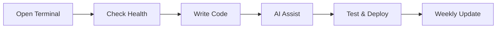

# User Guide

Day-to-day usage of your OpenCode Initializer-powered development environment.

## Daily Workflow



## The `dev` CLI

Your main management tool after installation. Available as `~/opencode_initializer/dev.sh`.

### Health Check

Run this first thing to verify your environment:

```bash
dev health
```

Output covers 11 sections:
1. **Core CLI** — OpenCode, dev CLI, setup.sh
2. **MCP Servers** — All configured MCP servers
3. **LSP Servers** — Language server configurations
4. **Services** — Docker, PostgreSQL, Qdrant, Redis
5. **Config** — opencode.json, AGENTS.md, .zshrc
6. **Multimodal & ONNX** — Multimedia + ONNX support
7. **Interaction Modes** — CLI modes
8. **Systemd Services** — Ollama, Open WebUI, ChromaDB
9. **Web Search (SearXNG)** — Self-hosted search engine
10. **Memory Chain** — MemoryLayer, Muninn
11. **MCP Binaries** — ~/.bun/bin/ entries

### Version Check

```bash
dev version-check
```

Compares installed versions against latest from:
- GitHub Releases (Go, Zig, Bun)
- API endpoints (Node, Python)
- Package registries (Rust, .NET)

### Update Tools

```bash
# Update dev tools only
dev update

# Full system update (all packages)
dev autoupdate
```

### Infrastructure Management

```bash
dev infra start     # Start all infra services
dev infra stop      # Stop all infra services
dev infra status    # Check service status
```

### Plugin Management

```bash
dev plugins list    # List installed plugins
dev plugins install # Install new plugin
dev plugins remove  # Remove plugin
```

### Observability

```bash
dev observability   # Open Grafana dashboards
```

### Web GUI

```bash
dev gui             # Start web management interface (port 4200)
```

### Isolated Circuit Mode

```bash
dev isolated on     # Enable air-gapped LLM mode
dev isolated off    # Disable, use cloud providers
dev isolated status # Check current state
```

### Model Management

```bash
dev models coding   # Recommend models for coding tasks
dev models install <model>  # Download local Ollama model
```

### Config Backup

```bash
dev backup create   # Create config backup
dev backup list     # List available backups
dev backup restore  # Restore from backup
```

## Working with AI

### Basic Code Generation

```bash
opencode "Create a Python Flask API with /health and /users endpoints"
```

### Code Review

```bash
opencode "Review the file src/main.go for security issues"
```

### Project Understanding

OpenCode reads your `AGENTS.md` and `opencode.json` for context:

```bash
opencode "Explain the architecture of this project"
```

## Managing Projects

### Create a New Project

```bash
bash setup.sh --new ~/my-new-project
```

This creates:
```
~/my-new-project/
├── AGENTS.md         # AI agent instructions
├── opencode.json     # AI config
├── docker-compose.yml
├── .gitignore
└── agents/           # Custom AI subagents
```

### Existing Project Integration

Just add an `AGENTS.md` to any project directory. OpenCode will pick it up automatically.

## MCP Servers

### List Active MCP Servers

```bash
cat ~/opencode_initializer/opencode.json | grep -A 3 '"mcpServers"'
```

### Add a Custom MCP Server

Edit `opencode.json` and add:

```json
{
  "mcpServers": {
    "my-server": {
      "type": "local",
      "command": ["node", "/path/to/server.js"]
    }
  }
}
```

### Troubleshoot MCP

```bash
# Check if Bun is installed
which bun

# Check MCP npm cache
ls ~/.cache/opencode-setup/mcp-cache/

# Reinstall MCP servers
bash setup.sh --reinit
```

## Docker

```bash
# Start Docker (if not auto-started)
sudo systemctl start docker

# Run a container
docker run hello-world

# Check Docker in health report
dev health
```

## Chrome (WSL2)

```bash
# Launch Chrome
chrome-open

# Launch with specific URL
chrome-open https://github.com
```

## LLM / GPU

### Check GPU

```bash
nvidia-smi
```

### Manage Ollama

```bash
# Start Ollama
systemctl --user start ollama

# List installed models
ollama list

# Pull a model
ollama pull llama3.2

# Test
ollama run llama3.2 "Hello!"
```

### Open WebUI

Access at `http://localhost:3000` after starting:

```bash
# Start Open WebUI (requires Ollama running)
systemctl --user start open-webui
```

## Logs

All installation output is logged:

```bash
ls -lt ~/.cache/opencode-setup/setup-*.log | head -1
```

View the latest log:

```bash
tail -100 ~/.cache/opencode-setup/setup-*.log
```

## Tips & Tricks

### Aliases

The installer adds useful aliases to your `.zshrc`:

```bash
alias dev='~/opencode_initializer/dev.sh'
alias chrome-open='google-chrome-stable --no-sandbox'
```

### Keyboard Shortcuts (ZSH with plugins)

| Shortcut | Action |
|----------|--------|
| `Ctrl+T` | Fuzzy file search (fzf) |
| `Ctrl+R` | Fuzzy history search |
| `Alt+C` | Fuzzy directory jump |
| `Tab` | Smart autocomplete (zsh-autosuggestions) |

### Performance Tips

1. **Close unused containers**: `docker system prune`
2. **Limit Ollama models**: Only pull what you use
3. **Clean npm cache**: `npm cache clean --force`
4. **Check disk**: `dev health` includes disk usage

### Backup Your Config

```bash
# Backup entire config
tar -czf opencode-backup-$(date +%Y%m%d).tar.gz \
  ~/.config/opencode-setup/ \
  ~/.config/opencode/ \
  ~/opencode_initializer/opencode.json
```

---

**See also:**
- [MCP, LSP & Plugins Reference](../reference/mcp-lsp-plugins/) — full catalogue of all servers
- [Advanced Guide](../advanced/) — WSL2, GPU, customization
- [FAQ](../faq/) — common issues and solutions
- [Architecture](../architecture/) — C4 diagrams and module reference
