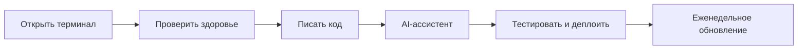

# Руководство пользователя

Повседневное использование вашего окружения на базе OpenCode Initializer.

## Ежедневный рабочий процесс



## CLI `dev`

Главный инструмент управления после установки. Доступен как `~/opencode_initializer/dev.sh`.

### Проверка здоровья

Запускайте первым делом для проверки окружения:

```bash
dev health
```

Вывод охватывает 11 разделов:
1. **Core CLI** — OpenCode, dev CLI, setup.sh
2. **MCP Servers** — Все настроенные MCP-серверы
3. **LSP Servers** — Конфигурации языковых серверов
4. **Services** — Docker, PostgreSQL, Qdrant, Redis
5. **Config** — opencode.json, AGENTS.md, .zshrc
6. **Multimodal & ONNX** — Мультимедиа + ONNX
7. **Interaction Modes** — Режимы CLI
8. **Systemd Services** — Ollama, Open WebUI, ChromaDB
9. **Web Search (SearXNG)** — Self-hosted поиск
10. **Memory Chain** — MemoryLayer, Muninn
11. **MCP Binaries** — ~/.bun/bin/ записи

### Проверка версий

```bash
dev version-check
```

Сравнивает установленные версии с последними из:
- GitHub Releases (Go, Zig, Bun)
- API (Node, Python)
- Реестров пакетов (Rust, .NET)

### Обновление

```bash
# Только инструменты разработки
dev update

# Полное обновление системы (все пакеты)
dev autoupdate
```

### Управление инфраструктурой

```bash
dev infra start     # Запустить все сервисы
dev infra stop      # Остановить все сервисы
dev infra status    # Проверить статус
```

### Управление плагинами

```bash
dev plugins list    # Список установленных плагинов
dev plugins install # Установить плагин
dev plugins remove  # Удалить плагин
```

### Наблюдаемость

```bash
dev observability   # Открыть дашборды Grafana
```

### Веб-интерфейс

```bash
dev gui             # Запустить веб-интерфейс (порт 4200)
```

### Режим Isolated Circuit

```bash
dev isolated on     # Включить air-gapped LLM
dev isolated off    # Выключить, использовать облако
dev isolated status # Проверить состояние
```

### Управление моделями

```bash
dev models coding   # Рекомендации моделей для кодинга
dev models install <model>  # Загрузить локальную модель
```

### Бэкап конфигурации

```bash
dev backup create   # Создать бэкап
dev backup list     # Список бэкапов
dev backup restore  # Восстановить из бэкапа
```

## Работа с AI

### Базовая кодогенерация

```bash
opencode "Создай Python Flask API с эндпоинтами /health и /users"
```

### Код-ревью

```bash
opencode "Проверь файл src/main.go на проблемы безопасности"
```

### Понимание проекта

OpenCode читает `AGENTS.md` и `opencode.json` для контекста:

```bash
opencode "Объясни архитектуру этого проекта"
```

## Управление проектами

### Создать новый проект

```bash
bash setup.sh --new ~/my-new-project
```

Создаётся:
```
~/my-new-project/
├── AGENTS.md         # Инструкции для AI
├── opencode.json     # AI конфигурация
├── docker-compose.yml
├── .gitignore
└── agents/           # Пользовательские AI субагенты
```

### Интеграция с существующим проектом

Просто добавьте `AGENTS.md` в любую папку проекта. OpenCode подхватит автоматически.

## MCP-серверы

### Список активных MCP

```bash
cat ~/opencode_initializer/opencode.json | grep -A 3 '"mcpServers"'
```

### Добавить свой MCP-сервер

Отредактируйте `opencode.json` и добавьте:

```json
{
  "mcpServers": {
    "my-server": {
      "type": "local",
      "command": ["node", "/path/to/server.js"]
    }
  }
}
```

### Диагностика MCP

```bash
# Проверить Bun
which bun

# Проверить кэш MCP
ls ~/.cache/opencode-setup/mcp-cache/

# Переустановить MCP
bash setup.sh --reinit
```

## Docker

```bash
# Запустить Docker
sudo systemctl start docker

# Тестовый контейнер
docker run hello-world

# Проверить в health
dev health
```

## Chrome (WSL2)

```bash
# Запустить Chrome
chrome-open

# С конкретным URL
chrome-open https://github.com
```

## LLM / GPU

### Проверить GPU

```bash
nvidia-smi
```

### Управление Ollama

```bash
# Запустить
systemctl --user start ollama

# Список моделей
ollama list

# Загрузить модель
ollama pull llama3.2

# Тест
ollama run llama3.2 "Привет!"
```

### Open WebUI

Доступен на `http://localhost:3000` после запуска:

```bash
systemctl --user start open-webui
```

## Логи

Весь вывод установки логируется:

```bash
ls -lt ~/.cache/opencode-setup/setup-*.log | head -1
```

Просмотр последнего лога:

```bash
tail -100 ~/.cache/opencode-setup/setup-*.log
```

## Советы

### Алиасы

Установщик добавляет полезные алиасы в `.zshrc`:

```bash
alias dev='~/opencode_initializer/dev.sh'
alias chrome-open='google-chrome-stable --no-sandbox'
```

### Горячие клавиши (ZSH с плагинами)

| Клавиши | Действие |
|---------|----------|
| `Ctrl+T` | Нечёткий поиск файлов (fzf) |
| `Ctrl+R` | Нечёткий поиск истории |
| `Alt+C` | Нечёткий переход по папкам |
| `Tab` | Умный автокомплит (zsh-autosuggestions) |

### Производительность

1. **Закрывайте неиспользуемые контейнеры**: `docker system prune`
2. **Ограничьте модели Ollama**: загружайте только нужные
3. **Чистите кэш npm**: `npm cache clean --force`
4. **Проверяйте диск**: `dev health` включает использование диска

### Бэкап конфигурации

```bash
tar -czf opencode-backup-$(date +%Y%m%d).tar.gz \
  ~/.config/opencode-setup/ \
  ~/.config/opencode/ \
  ~/opencode_initializer/opencode.json
```
